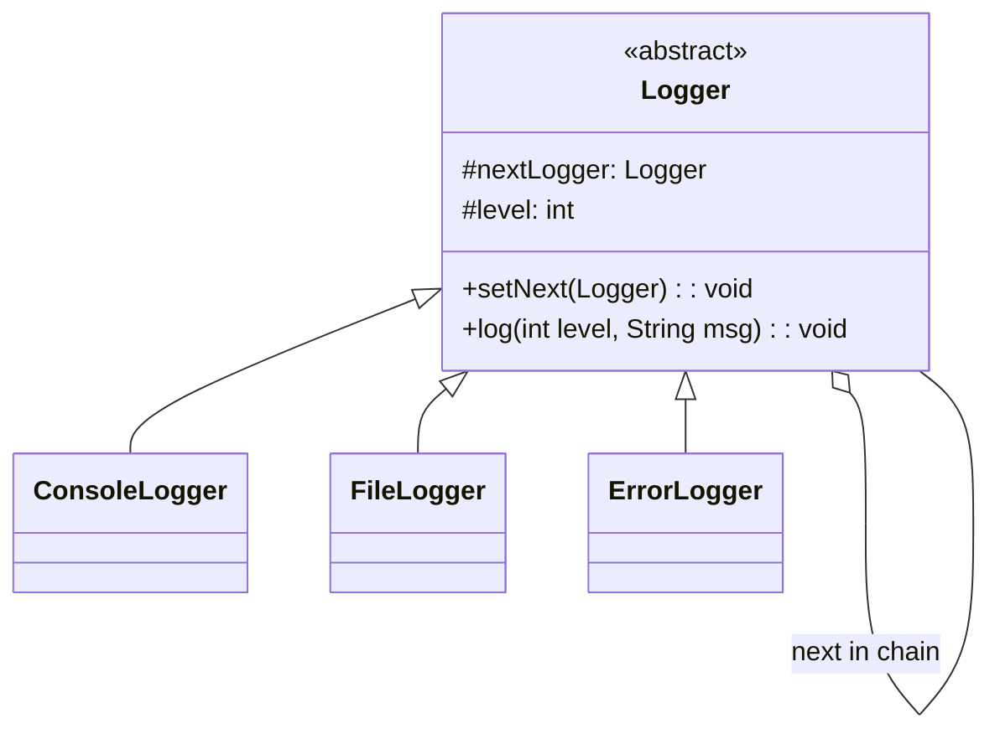

# Chain of Responsibility

Pass request along chain of handlers until one handles it

Request → Handler1 → Handler2 → Handler3 → null

## Example
ATM withdrawal: 500 note → 200 note → 100 note handler

## UML Diagram



## Key Points

- Logger HAS-A Logger (next handler) - Self-referential
- Each handler decides: process it OR pass to next
- Sender only knows first handler

## Code

```java
public abstract class Logger {
    protected Logger nextLogger;
    protected int level;
    
    public void setNext(Logger next) {
        this.nextLogger = next;
    }
    
    public void log(int level, String msg) {
        if (this.level <= level) {
            write(msg);
        }
        if (nextLogger != null) {
            nextLogger.log(level, msg);
        }
    }
    
    protected abstract void write(String msg);
}

// Usage - Build chain
Logger console = new ConsoleLogger(1);
Logger file = new FileLogger(2);
Logger error = new ErrorLogger(3);

console.setNext(file);
file.setNext(error);

console.log(2, "Debug message");  
// Console logs, File logs, Error skips
```

## When to use?

- Multiple handlers might process request
- Don't know which handler in advance
- Want to decouple sender from receivers
