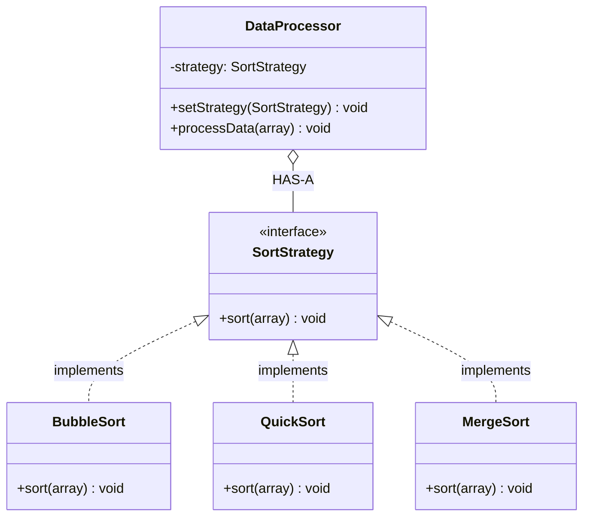

# Strategy

Swap algorithms at runtime

Context HAS-A Strategy (composition)

## Example
Payment: CreditCard / UPI / Wallet

## UML Diagram



## Key Points

- DataProcessor HAS-A SortStrategy
- Client picks strategy at runtime
- Algorithms interchangeable via composition

## Code

```java
public interface SortStrategy {
    void sort(int[] array);
}

public class QuickSort implements SortStrategy {
    public void sort(int[] array) {
        // QuickSort implementation
    }
}

public class DataProcessor {
    private SortStrategy strategy;
    
    public void setStrategy(SortStrategy strategy) {
        this.strategy = strategy;
    }
    
    public void processData(int[] array) {
        strategy.sort(array);
    }
}

// Usage - Switch strategy
DataProcessor processor = new DataProcessor();
processor.setStrategy(new QuickSort());
processor.processData(data);

processor.setStrategy(new MergeSort());  // Change strategy
processor.processData(data);
```

## When to use?

- Multiple algorithms for same task
- Need to switch algorithm at runtime
- Avoid large if-else for algorithm selection
