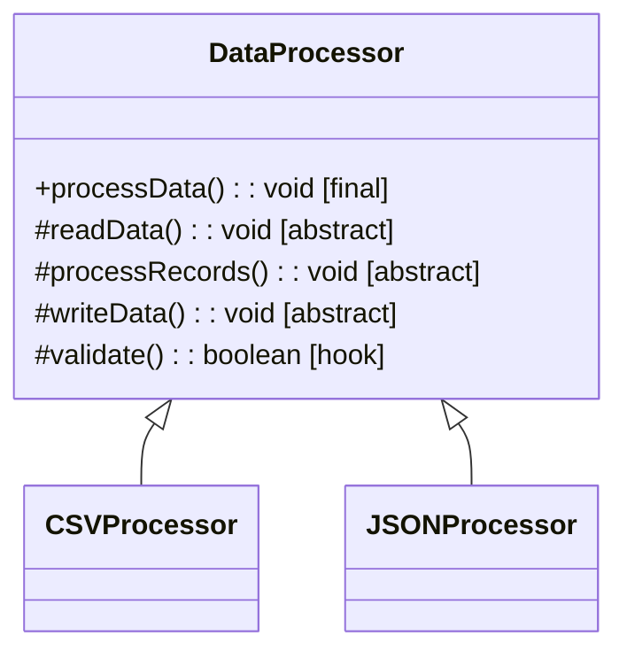

# Template Method Design Pattern

## What is Template Method?
Template Method defines the skeleton of an algorithm in a base class but lets subclasses override specific steps without changing the algorithm's structure.

**Key Idea:** Base class defines algorithm steps (template). Subclasses implement specific steps. Algorithm flow controlled by base class.

---

## Why Use Template Method? (Problem it solves)

**Problem:**
- Multiple classes with similar algorithm structure
- Only specific steps vary between implementations
- Want to enforce algorithm flow (prevent subclasses from changing order)
- Code duplication across similar algorithms

**Solution:**
- Define template method in base class (final, can't override)
- Template method calls abstract/hook methods
- Subclasses implement abstract methods (mandatory)
- Subclasses can optionally override hook methods

---

## Real-World Analogy

**Recipe Template:**
- Recipe steps: Prepare ingredients → Cook → Serve
- All recipes follow this flow (template)
- Each recipe implements steps differently:
  - Pasta: Boil water, cook pasta, add sauce
  - Stir-fry: Heat oil, fry vegetables, add seasoning
- Recipe template ensures steps happen in order

---

## Simple Example (Data Processing)

### UML Diagram: Template Method Relationships



### Relationship Explanations

**1. IS-A Relationships:**
- `CSVProcessor` **IS-A** `DataProcessor` → extends base class
- `JSONProcessor` **IS-A** `DataProcessor` → extends base class

**2. Template Method Pattern:**
- Base class has **final** template method (can't override)
- Template method calls abstract/hook methods
- Subclasses implement abstract methods
- **Key:** Base class controls flow, subclasses provide implementation

**3. Method Types:**
```
1. Template Method (final): processData() → controls flow, calls steps
2. Abstract Methods: readData(), processRecords() → subclasses must implement
3. Hook Methods: validate() → optional override, has default implementation
```

- Template method enforces algorithm structure (Hollywood Principle: "Don't call us, we'll call you")
- Subclasses can't change algorithm flow (only implement steps)
- Hooks provide extension points without forcing override

```java
// Abstract base class
public abstract class DataProcessor {
    
    // Template method (final: subclasses can't override)
    public final void processData() {
        readData();
        
        if (validate()) {  // Hook method
            processRecords();
            writeData();
        } else {
            System.out.println("Validation failed");
        }
    }
    
    // Abstract methods (subclasses must implement)
    protected abstract void readData();
    protected abstract void processRecords();
    protected abstract void writeData();
    
    // Hook method (optional override, default implementation)
    protected boolean validate() {
        return true;  // Default: always valid
    }
}

// Concrete class 1: CSV Processor
public class CSVProcessor extends DataProcessor {
    @Override
    protected void readData() {
        System.out.println("Reading CSV file");
    }
    
    @Override
    protected void processRecords() {
        System.out.println("Processing CSV records");
    }
    
    @Override
    protected void writeData() {
        System.out.println("Writing CSV output");
    }
    
    // Optional: override hook method
    @Override
    protected boolean validate() {
        System.out.println("Validating CSV format");
        return true;
    }
}

// Concrete class 2: JSON Processor
public class JSONProcessor extends DataProcessor {
    @Override
    protected void readData() {
        System.out.println("Reading JSON file");
    }
    
    @Override
    protected void processRecords() {
        System.out.println("Processing JSON records");
    }
    
    @Override
    protected void writeData() {
        System.out.println("Writing JSON output");
    }
    
    // Uses default validate() hook (doesn't override)
}

// Usage
public class TemplateMethodDemo {
    public static void main(String[] args) {
        DataProcessor csvProcessor = new CSVProcessor();
        csvProcessor.processData();
        
        System.out.println();
        
        DataProcessor jsonProcessor = new JSONProcessor();
        jsonProcessor.processData();
        
        /* Output:
         * Reading CSV file
         * Validating CSV format
         * Processing CSV records
         * Writing CSV output
         * 
         * Reading JSON file
         * Processing JSON records
         * Writing JSON output
         */
    }
}
```

---

## E-commerce Example (Order Processing Template)

```java
// Abstract base class: Order Processor
public abstract class OrderProcessor {
    
    // Template method (defines order processing flow)
    public final void processOrder(String orderId) {
        System.out.println("Processing order: " + orderId);
        
        validateOrder(orderId);
        calculateTotal(orderId);
        
        if (applyDiscount(orderId)) {  // Hook
            System.out.println("Discount applied");
        }
        
        processPayment(orderId);
        shipOrder(orderId);
        sendConfirmation(orderId);
        
        System.out.println("Order " + orderId + " completed\n");
    }
    
    // Abstract methods (subclasses must implement)
    protected abstract void validateOrder(String orderId);
    protected abstract void calculateTotal(String orderId);
    protected abstract void processPayment(String orderId);
    protected abstract void shipOrder(String orderId);
    
    // Hook methods (optional override)
    protected boolean applyDiscount(String orderId) {
        return false;  // Default: no discount
    }
    
    protected void sendConfirmation(String orderId) {
        System.out.println("Sending confirmation email for " + orderId);
    }
}

// Concrete class 1: Standard Order
public class StandardOrderProcessor extends OrderProcessor {
    @Override
    protected void validateOrder(String orderId) {
        System.out.println("Validating standard order");
    }
    
    @Override
    protected void calculateTotal(String orderId) {
        System.out.println("Calculating total: $100");
    }
    
    @Override
    protected void processPayment(String orderId) {
        System.out.println("Processing payment: $100");
    }
    
    @Override
    protected void shipOrder(String orderId) {
        System.out.println("Shipping via standard delivery (5-7 days)");
    }
}

// Concrete class 2: Premium Order (overrides hook)
public class PremiumOrderProcessor extends OrderProcessor {
    @Override
    protected void validateOrder(String orderId) {
        System.out.println("Validating premium order");
    }
    
    @Override
    protected void calculateTotal(String orderId) {
        System.out.println("Calculating total: $500");
    }
    
    @Override
    protected void processPayment(String orderId) {
        System.out.println("Processing payment: $500");
    }
    
    @Override
    protected void shipOrder(String orderId) {
        System.out.println("Shipping via express delivery (1-2 days)");
    }
    
    // Override hook: premium orders get discount
    @Override
    protected boolean applyDiscount(String orderId) {
        System.out.println("Applying 10% premium member discount");
        return true;
    }
    
    // Override hook: premium orders get SMS notification
    @Override
    protected void sendConfirmation(String orderId) {
        System.out.println("Sending SMS + email confirmation for " + orderId);
    }
}

// Usage
public class OrderProcessingDemo {
    public static void main(String[] args) {
        OrderProcessor standardProcessor = new StandardOrderProcessor();
        standardProcessor.processOrder("ORD-001");
        
        OrderProcessor premiumProcessor = new PremiumOrderProcessor();
        premiumProcessor.processOrder("ORD-002");
        
        /* Output:
         * Processing order: ORD-001
         * Validating standard order
         * Calculating total: $100
         * Processing payment: $100
         * Shipping via standard delivery (5-7 days)
         * Sending confirmation email for ORD-001
         * Order ORD-001 completed
         * 
         * Processing order: ORD-002
         * Validating premium order
         * Calculating total: $500
         * Applying 10% premium member discount
         * Discount applied
         * Processing payment: $500
         * Shipping via express delivery (1-2 days)
         * Sending SMS + email confirmation for ORD-002
         * Order ORD-002 completed
         */
    }
}
```

---

## When to Use Template Method

**Use when:**
- Multiple classes share algorithm structure with varying steps
- Want to enforce algorithm flow (prevent reordering)
- Need common behavior with extension points (hooks)
- Example: frameworks (lifecycle hooks), workflows, report generation

**Don't use when:**
- Algorithm steps vary completely (no common structure)
- Need runtime algorithm selection (use Strategy)
- Inheritance not appropriate (prefer composition)

---

End of Template Method Pattern
