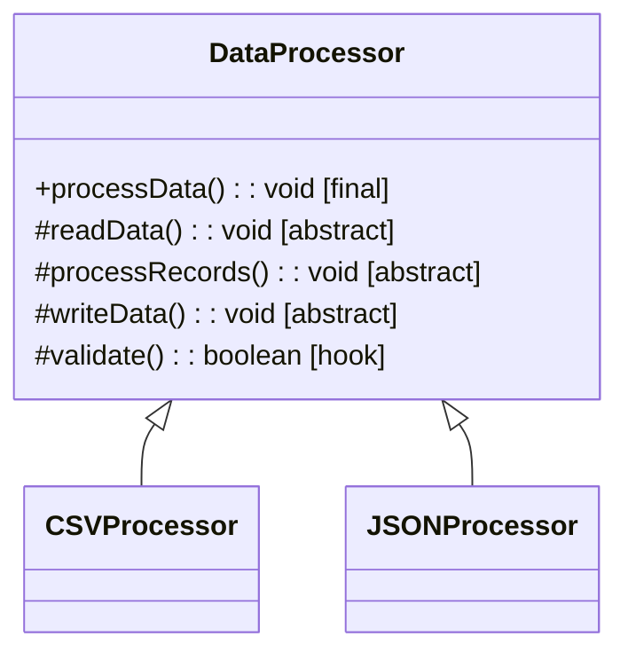

# Template Method

Define skeleton, subclass fills steps

Base class controls flow (template method is final)

## Example
Coffee/Tea maker: boil → brew → pour

## UML Diagram



## Key Points

- Template method is final (can't override)
- Subclasses implement abstract methods
- Base class controls algorithm flow

## Code

```java
public abstract class DataProcessor {
    // Template method - final
    public final void processData() {
        readData();
        if (validate()) {
            processRecords();
            writeData();
        }
    }
    
    protected abstract void readData();
    protected abstract void processRecords();
    protected abstract void writeData();
    
    // Hook method (optional override)
    protected boolean validate() {
        return true;
    }
}

public class CSVProcessor extends DataProcessor {
    protected void readData() {
        // Read CSV
    }
    
    protected void processRecords() {
        // Process CSV
    }
    
    protected void writeData() {
        // Write CSV
    }
}

// Usage
DataProcessor processor = new CSVProcessor();
processor.processData();  // Follows template flow
```

## When to use?

- Common algorithm structure, varying steps
- Want to enforce algorithm flow
- Avoid code duplication across similar algorithms
