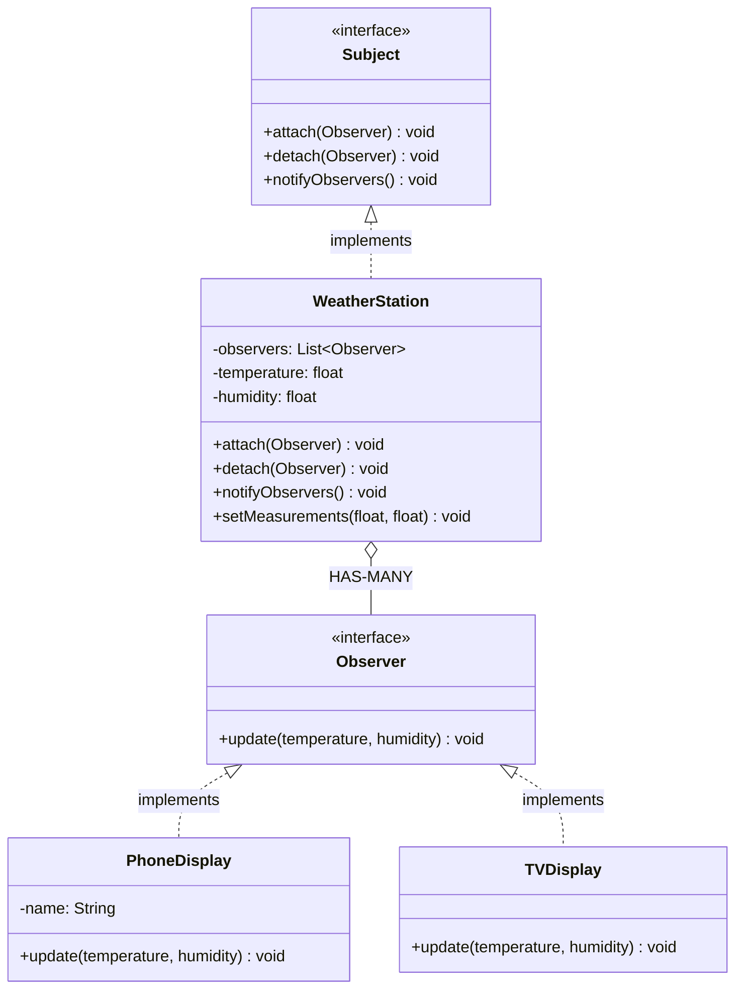

# Observer

Notify all when one changes

Subject HAS-MANY Observers (one-to-many)

## Example
YouTube Channel → Subscribers get notification

## UML Diagram



## Key Points

- WeatherStation HAS-MANY Observers
- Observers subscribe/unsubscribe dynamically
- Subject notifies all observers on state change

## Code

```java
public interface Observer {
    void update(float temp, float humidity);
}

public class WeatherStation {
    private List<Observer> observers = new ArrayList<>();
    private float temperature;
    private float humidity;
    
    public void attach(Observer obs) {
        observers.add(obs);
    }
    
    public void detach(Observer obs) {
        observers.remove(obs);
    }
    
    public void notifyObservers() {
        for (Observer obs : observers) {
            obs.update(temperature, humidity);
        }
    }
    
    public void setMeasurements(float temp, float humidity) {
        this.temperature = temp;
        this.humidity = humidity;
        notifyObservers();
    }
}

// Usage
WeatherStation station = new WeatherStation();
PhoneDisplay phone = new PhoneDisplay();
TVDisplay tv = new TVDisplay();

station.attach(phone);
station.attach(tv);

station.setMeasurements(25.5f, 60.0f);  
// Both phone and TV get notified
```

## When to use?

- One object changes, many need to react
- Need loose coupling between subject and observers
- Dynamic list of observers
