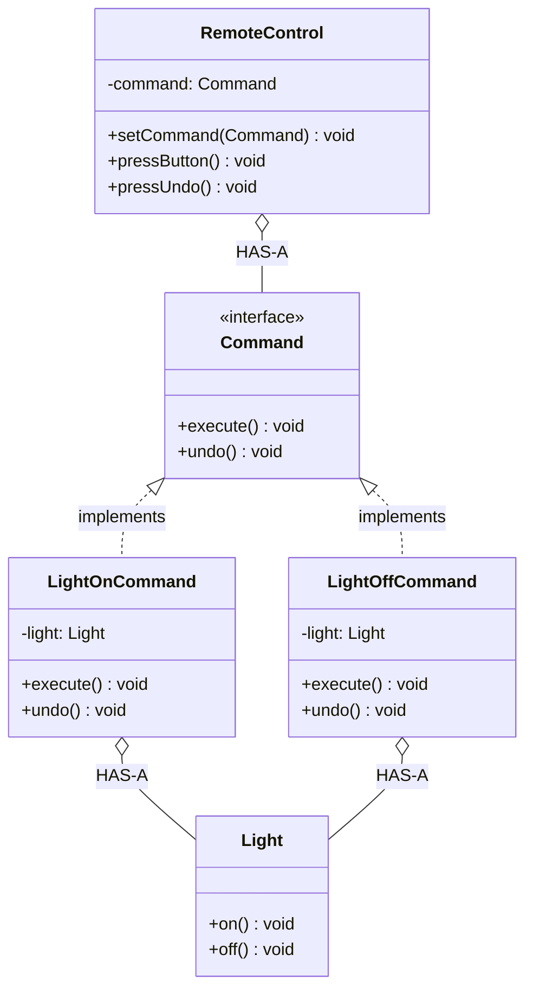

# Command

Wrap request as object

Command HAS-A Receiver, Invoker HAS-A Command

## Example
Remote Control - each button is a command (supports undo)

## UML Diagram



## Key Points

- Command HAS-A Receiver (Light)
- Invoker (Remote) HAS-A Command
- Supports undo/redo via command history

## Code

```java
public interface Command {
    void execute();
    void undo();
}

public class LightOnCommand implements Command {
    private Light light;
    
    public LightOnCommand(Light light) {
        this.light = light;
    }
    
    public void execute() {
        light.on();
    }
    
    public void undo() {
        light.off();
    }
}

public class RemoteControl {
    private Command command;
    private Stack<Command> history = new Stack<>();
    
    public void setCommand(Command command) {
        this.command = command;
    }
    
    public void pressButton() {
        command.execute();
        history.push(command);
    }
    
    public void pressUndo() {
        if (!history.isEmpty()) {
            history.pop().undo();
        }
    }
}

// Usage
Light light = new Light();
Command lightOn = new LightOnCommand(light);

RemoteControl remote = new RemoteControl();
remote.setCommand(lightOn);
remote.pressButton();  // Light on
remote.pressUndo();    // Light off
```

## When to use?

- Need undo/redo functionality
- Want to queue, schedule, or log operations
- Decouple invoker from receiver
