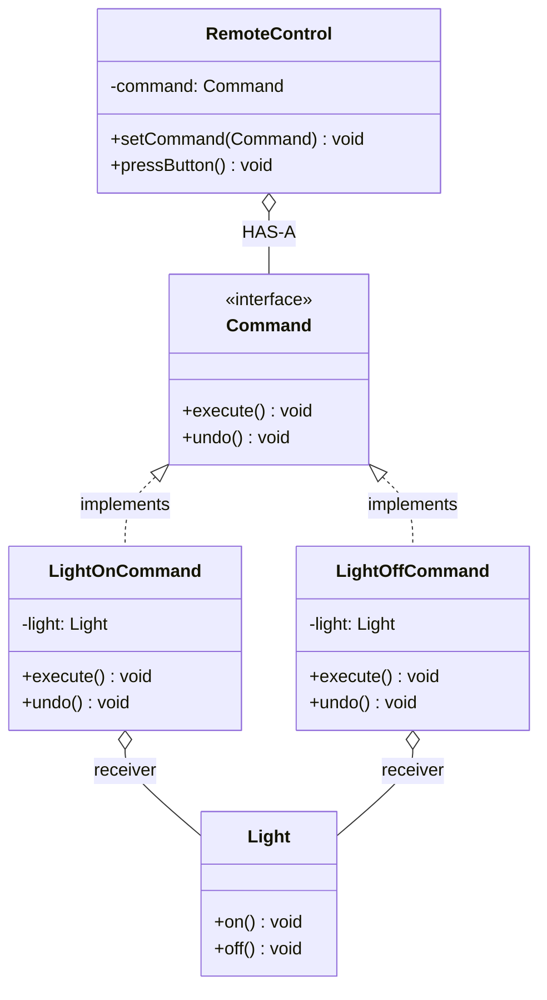

# Command Design Pattern

## What is Command Pattern?
Command encapsulates a request as an object, allowing you to parameterize clients with different requests, queue requests, log requests, and support undo operations.

**Key Idea:** Turn requests into standalone objects containing all information about the request.

---

## Why Use Command? (Problem it solves)

**Problem:**
- You need to issue requests without knowing the receiver or operation details
- Want to queue, schedule, or log operations
- Need undo/redo functionality
- Want to decouple invoker (button, menu) from receiver (business logic)

**Solution:**
- Wrap requests in Command objects with `execute()` method
- Invoker calls `command.execute()` without knowing what happens inside
- Commands can store state for undo and history tracking

---

## Real-World Analogy

**Restaurant Order:**
- **Customer (client):** places order
- **Waiter (invoker):** takes order slip, doesn't cook
- **Order slip (command):** contains all details (what, how many, table #)
- **Chef (receiver):** reads slip and prepares food
- Order slip can be queued, logged, or canceled (undo)

---

## Simple Example (Remote Control)

### UML Diagram: Command Pattern Relationships



### Relationship Explanations

**1. IS-A Relationships:**
- `LightOnCommand` **IS-A** `Command` → implements Command interface
- `LightOffCommand` **IS-A** `Command` → implements Command interface
- **Purpose:** All commands have uniform `execute()` interface

**2. HAS-A Relationships:**
- `Command` **HAS-A** `Receiver` → command holds reference to receiver (Light)
- `RemoteControl` **HAS-A** `Command` → invoker holds command to execute
- **Key:** Invoker doesn't know about receiver, only knows Command interface

**3. Flow:**
```
Client → creates Command(receiver)
      → gives Command to Invoker (RemoteControl)
Invoker.pressButton() → command.execute() → receiver.on()
```

- Command wraps receiver + action
- Invoker decoupled from receiver
- Easy to add new commands without changing invoker

```java
// Command interface
public interface Command {
    void execute();
    void undo();  // Optional: for undo functionality
}

// Receiver: the object that does the actual work
public class Light {
    public void on() {
        System.out.println("Light is ON");
    }
    
    public void off() {
        System.out.println("Light is OFF");
    }
}

// Concrete Command 1: Turn light on
public class LightOnCommand implements Command {
    private Light light;  // Receiver
    
    public LightOnCommand(Light light) {
        this.light = light;
    }
    
    @Override
    public void execute() {
        light.on();  // Delegate to receiver
    }
    
    @Override
    public void undo() {
        light.off();  // Reverse the action
    }
}

// Concrete Command 2: Turn light off
public class LightOffCommand implements Command {
    private Light light;
    
    public LightOffCommand(Light light) {
        this.light = light;
    }
    
    @Override
    public void execute() {
        light.off();
    }
    
    @Override
    public void undo() {
        light.on();
    }
}

// Invoker: triggers commands without knowing details
public class RemoteControl {
    private Command command;
    
    public void setCommand(Command command) {
        this.command = command;
    }
    
    public void pressButton() {
        command.execute();
    }
    
    public void pressUndo() {
        command.undo();
    }
}

// Usage
public class CommandDemo {
    public static void main(String[] args) {
        // Receiver
        Light livingRoomLight = new Light();
        
        // Commands
        Command lightOn = new LightOnCommand(livingRoomLight);
        Command lightOff = new LightOffCommand(livingRoomLight);
        
        // Invoker
        RemoteControl remote = new RemoteControl();
        
        // Turn light on
        remote.setCommand(lightOn);
        remote.pressButton();  // Light is ON
        
        // Turn light off
        remote.setCommand(lightOff);
        remote.pressButton();  // Light is OFF
        
        // Undo last action
        remote.pressUndo();  // Light is ON (undo off)
    }
}
```

**How the Code Works (Step-by-step Flow):**

1. **Setup Phase:**
   - Create Receiver: `Light livingRoomLight = new Light()`
   - Create Commands: 
     - `lightOn = new LightOnCommand(livingRoomLight)` (wraps receiver)
     - `lightOff = new LightOffCommand(livingRoomLight)` (wraps receiver)
   - Create Invoker: `RemoteControl remote = new RemoteControl()`

2. **First Action: Turn light ON**
   - `remote.setCommand(lightOn)` → remote stores LightOnCommand
   - `remote.pressButton()` → calls `command.execute()`
   - `LightOnCommand.execute()` → calls `light.on()`
   - `Light.on()` → prints "Light is ON"
   - **Flow:** RemoteControl → LightOnCommand → Light (receiver)

3. **Second Action: Turn light OFF**
   - `remote.setCommand(lightOff)` → remote stores LightOffCommand (replaces previous)
   - `remote.pressButton()` → calls `command.execute()`
   - `LightOffCommand.execute()` → calls `light.off()`
   - `Light.off()` → prints "Light is OFF"
   - **Flow:** RemoteControl → LightOffCommand → Light (receiver)

4. **Undo Action:**
   - `remote.pressUndo()` → calls `command.undo()` (on currently stored LightOffCommand)
   - `LightOffCommand.undo()` → calls `light.on()` (opposite of execute)
   - `Light.on()` → prints "Light is ON"
   - **Result:** Light back to ON state

**Key Insight:** 
- RemoteControl **never** knows about Light class (decoupling)
- Commands encapsulate: receiver + action + undo action
- Same button executes different commands based on what's set

---

## E-commerce Example (Order Processing with Undo)

```java
// Receiver: Order service
public class OrderService {
    public void placeOrder(String orderId) {
        System.out.println("Order " + orderId + " placed");
    }
    
    public void cancelOrder(String orderId) {
        System.out.println("Order " + orderId + " canceled");
    }
    
    public void shipOrder(String orderId) {
        System.out.println("Order " + orderId + " shipped");
    }
}

// Command interface
public interface OrderCommand {
    void execute();
    void undo();
}

// Concrete Command: Place Order
public class PlaceOrderCommand implements OrderCommand {
    private OrderService service;
    private String orderId;
    
    public PlaceOrderCommand(OrderService service, String orderId) {
        this.service = service;
        this.orderId = orderId;
    }
    
    @Override
    public void execute() {
        service.placeOrder(orderId);
    }
    
    @Override
    public void undo() {
        service.cancelOrder(orderId);  // Reverse placement
    }
}

// Concrete Command: Ship Order
public class ShipOrderCommand implements OrderCommand {
    private OrderService service;
    private String orderId;
    
    public ShipOrderCommand(OrderService service, String orderId) {
        this.service = service;
        this.orderId = orderId;
    }
    
    @Override
    public void execute() {
        service.shipOrder(orderId);
    }
    
    @Override
    public void undo() {
        System.out.println("Cannot undo shipping (already shipped)");
    }
}

// Invoker with history (for undo support)
public class OrderManager {
    private List<OrderCommand> history = new ArrayList<>();
    
    public void executeCommand(OrderCommand command) {
        command.execute();
        history.add(command);  // Track for undo
    }
    
    public void undoLast() {
        if (!history.isEmpty()) {
            OrderCommand lastCommand = history.remove(history.size() - 1);
            lastCommand.undo();
        } else {
            System.out.println("Nothing to undo");
        }
    }
}

// Usage
public class EcommerceCommandDemo {
    public static void main(String[] args) {
        OrderService service = new OrderService();
        OrderManager manager = new OrderManager();
        
        // Execute commands
        OrderCommand placeOrder = new PlaceOrderCommand(service, "ORD-123");
        manager.executeCommand(placeOrder);  // Order ORD-123 placed
        
        OrderCommand shipOrder = new ShipOrderCommand(service, "ORD-123");
        manager.executeCommand(shipOrder);  // Order ORD-123 shipped
        
        // Undo last action
        manager.undoLast();  // Cannot undo shipping
        manager.undoLast();  // Order ORD-123 canceled (undo placement)
    }
}
```

**How the Code Works (Step-by-step Flow):**

1. **Setup Phase:**
   - Create Receiver: `OrderService service = new OrderService()`
   - Create Invoker: `OrderManager manager = new OrderManager()`
   - History list: `[]` (empty)

2. **Execute First Command: Place Order**
   - Create: `placeOrder = new PlaceOrderCommand(service, "ORD-123")`
   - `manager.executeCommand(placeOrder)`:
     - Calls `placeOrder.execute()` → `service.placeOrder("ORD-123")` → prints "Order ORD-123 placed"
     - Adds to history: `[placeOrder]`

3. **Execute Second Command: Ship Order**
   - Create: `shipOrder = new ShipOrderCommand(service, "ORD-123")`
   - `manager.executeCommand(shipOrder)`:
     - Calls `shipOrder.execute()` → `service.shipOrder("ORD-123")` → prints "Order ORD-123 shipped"
     - Adds to history: `[placeOrder, shipOrder]`

4. **First Undo:**
   - `manager.undoLast()`:
     - Removes last from history: `shipOrder`
     - Calls `shipOrder.undo()` → prints "Cannot undo shipping" (business rule)
     - History now: `[placeOrder]`

5. **Second Undo:**
   - `manager.undoLast()`:
     - Removes last from history: `placeOrder`
     - Calls `placeOrder.undo()` → `service.cancelOrder("ORD-123")` → prints "Order ORD-123 canceled"
     - History now: `[]` (empty)

**Key Insight:** 
- History list enables multi-level undo (LIFO: Last In First Out)
- Some operations can't be undone (shipOrder) - business logic in command
- Each command knows how to reverse itself (or refuse to)

---

## When to Use Command

**Use when:**
- Need to parameterize objects with operations
- Want to queue, schedule, or log operations
- Need undo/redo functionality
- Want to decouple invoker from receiver
- Example: UI buttons/menus, transaction systems, job schedulers

**Don't use when:**
- Simple direct method calls suffice (no history, queuing, or undo needed)
- Adding abstraction layer adds unnecessary complexity

---

End of Command Pattern
