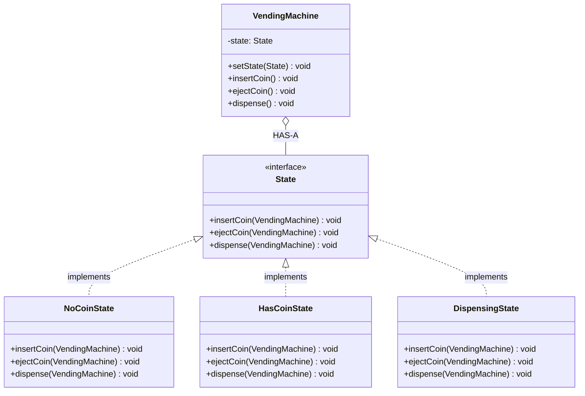

# State

Change behavior when state changes

Context HAS-A State object

## Example
Vending Machine: NoCoin → HasCoin → Dispensed

## UML Diagram



## Key Points

- VendingMachine HAS-A State
- Context delegates to current state
- States manage transitions themselves

## Code

```java
public interface State {
    void insertCoin(VendingMachine vm);
    void ejectCoin(VendingMachine vm);
    void dispense(VendingMachine vm);
}

public class NoCoinState implements State {
    public void insertCoin(VendingMachine vm) {
        System.out.println("Coin inserted");
        vm.setState(new HasCoinState());
    }
    
    public void ejectCoin(VendingMachine vm) {
        System.out.println("No coin to eject");
    }
    
    public void dispense(VendingMachine vm) {
        System.out.println("Insert coin first");
    }
}

public class VendingMachine {
    private State state;
    
    public VendingMachine() {
        state = new NoCoinState();
    }
    
    public void setState(State state) {
        this.state = state;
    }
    
    public void insertCoin() {
        state.insertCoin(this);
    }
    
    public void dispense() {
        state.dispense(this);
    }
}

// Usage
VendingMachine vm = new VendingMachine();
vm.insertCoin();  // State changes to HasCoinState
vm.dispense();    // State changes to DispensingState
```

## When to use?

- Object behavior depends on state
- Avoid large if-else/switch based on state
- State transitions managed by states themselves
