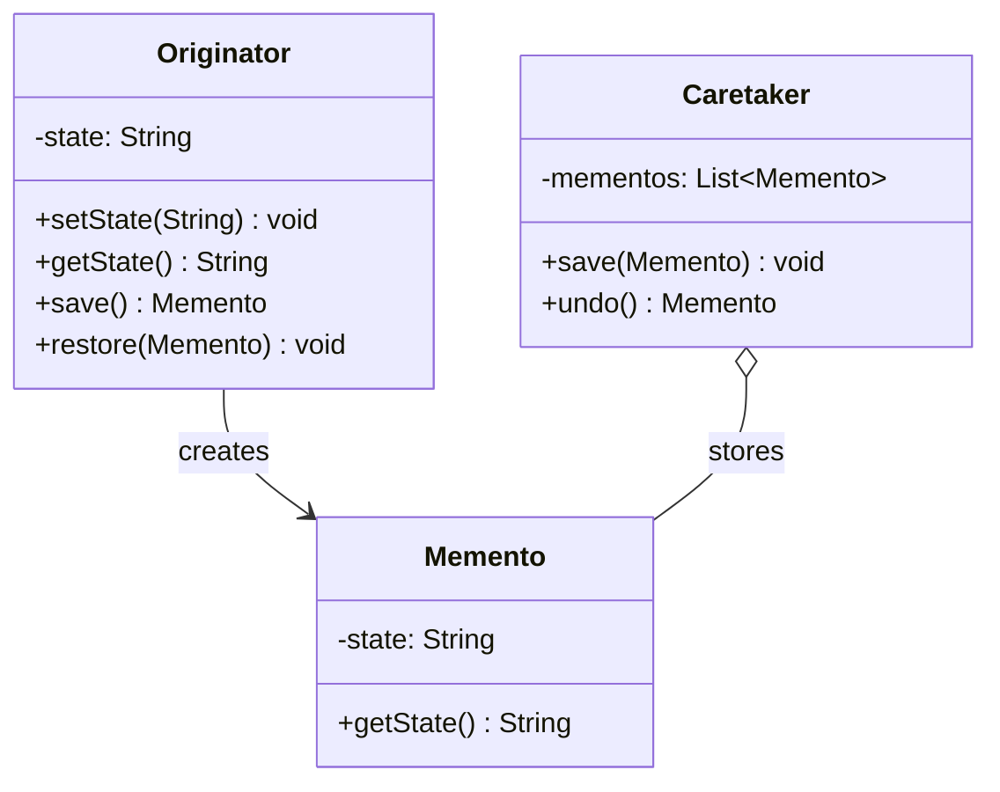

# Memento

Save/restore state (undo/snapshot)

Originator creates Memento, Caretaker stores it

## Example
Text editor undo - save snapshots of text

## UML Diagram



## Key Points

- Originator creates and restores from Memento
- Caretaker stores Mementos (history)
- Memento is opaque to Caretaker (can't examine)

## Code

```java
public class Memento {
    private final String state;
    
    public Memento(String state) {
        this.state = state;
    }
    
    public String getState() {
        return state;
    }
}

public class TextEditor {
    private String text;
    
    public void setText(String text) {
        this.text = text;
    }
    
    public String getText() {
        return text;
    }
    
    public Memento save() {
        return new Memento(text);
    }
    
    public void restore(Memento memento) {
        this.text = memento.getState();
    }
}

public class History {
    private Stack<Memento> history = new Stack<>();
    
    public void save(Memento memento) {
        history.push(memento);
    }
    
    public Memento undo() {
        if (!history.isEmpty()) {
            return history.pop();
        }
        return null;
    }
}

// Usage
TextEditor editor = new TextEditor();
History history = new History();

editor.setText("Hello");
history.save(editor.save());

editor.setText("Hello World");
history.save(editor.save());

editor.restore(history.undo());  // Back to "Hello"
```

## When to use?

- Need undo/redo functionality
- Save snapshots without breaking encapsulation
- Restore object to previous state
