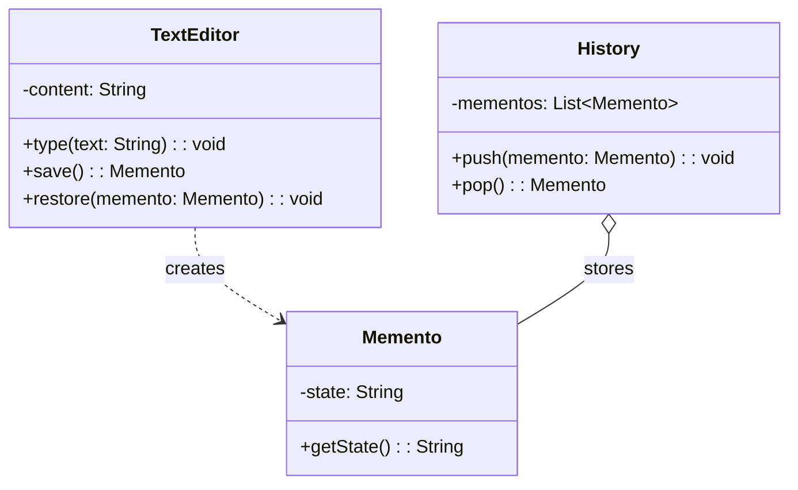

# Memento Design Pattern

## What is Memento Pattern?
Memento captures and externalizes an object's internal state without violating encapsulation, so the object can be restored to this state later (undo/redo).

**Key Idea:** Save snapshots of object state to restore later, without exposing internal structure.

---

## Why Use Memento? (Problem it solves)

**Problem:**
- Need to save/restore object state (undo functionality)
- Don't want to expose internal state (violates encapsulation)
- Client shouldn't manipulate saved state directly

**Solution:**
- Object (Originator) creates Memento containing snapshot
- Caretaker stores Memento but can't see inside it
- Later, Originator restores state from Memento

---

## Real-World Analogy

**Save Game:**
- Video game saves your progress (health, position, inventory) to a file
- You can load the save later to restore exact state
- Save file is opaque (you can't edit it directly)
- Game engine knows how to pack/unpack the save file

---

## Simple Example (Text Editor Undo)

### UML Diagram: Memento Pattern Relationships



### Relationship Explanations

**1. Roles:**
- **Originator:** `TextEditor` — creates and restores from Memento
- **Memento:** `Memento` — stores snapshot of originator's state
- **Caretaker:** `History` — stores mementos but doesn't examine them

**2. Relationships:**
- Originator creates Memento (dependency)
- Caretaker HAS-MANY Mementos (aggregation)
- **Key:** Memento is opaque to Caretaker (encapsulation preserved)

**3. State Flow:**
```
1. Editor.save() → creates Memento(currentState)
2. History.push(memento) → stores snapshot
3. User types more text
4. User hits Undo
5. History.pop() → returns Memento
6. Editor.restore(memento) → restores old state
```


- Memento pattern preserves encapsulation (Caretaker can't modify state)
- Originator is the only one who can pack/unpack Memento
- History is just a stack of opaque snapshots

```java
// Memento: Stores editor state
public class Memento {
    private final String state;  // Immutable snapshot
    
    public Memento(String state) {
        this.state = state;
    }
    
    public String getState() {
        return state;
    }
}

// Originator: TextEditor creates and restores from Memento
public class TextEditor {
    private String content = "";
    
    public void type(String text) {
        content += text;
    }
    
    public String getContent() {
        return content;
    }
    
    // Save current state to Memento
    public Memento save() {
        return new Memento(content);
    }
    
    // Restore state from Memento
    public void restore(Memento memento) {
        content = memento.getState();
    }
}

// Caretaker: History manages mementos (undo stack)
public class History {
    private Stack<Memento> mementos = new Stack<>();
    
    public void push(Memento memento) {
        mementos.push(memento);
    }
    
    public Memento pop() {
        if (!mementos.isEmpty()) {
            return mementos.pop();
        }
        return null;
    }
}

// Usage: Text editor with undo
public class MementoDemo {
    public static void main(String[] args) {
        TextEditor editor = new TextEditor();
        History history = new History();
        
        // Type and save
        editor.type("Hello ");
        history.push(editor.save());  // Save state 1
        
        editor.type("World");
        history.push(editor.save());  // Save state 2
        
        editor.type("!!!");
        System.out.println("Current: " + editor.getContent());  // Hello World!!!
        
        // Undo last change
        editor.restore(history.pop());
        System.out.println("After undo: " + editor.getContent());  // Hello World
        
        // Undo again
        editor.restore(history.pop());
        System.out.println("After undo: " + editor.getContent());  // Hello 
    }
}
```

**How the Code Works (Step-by-step Flow):**

1. **Setup:**
   - `TextEditor editor` (Originator) - manages content
   - `History history` (Caretaker) - stores mementos
   - Stack: `[]`

2. **Type "Hello":**
   - `editor.setContent("Hello")` → content = "Hello"
   - `editor.save()` → creates `Memento("Hello")`
   - `history.push(memento)` → Stack: `[Memento("Hello")]`

3. **Type " World":**
   - `editor.setContent("Hello World")` → content = "Hello World"
   - `editor.save()` → creates `Memento("Hello World")`
   - `history.push(memento)` → Stack: `[Memento("Hello"), Memento("Hello World")]`

4. **Type "!!!":**
   - `editor.setContent("Hello World!!!")` → content = "Hello World!!!"
   - No save → current state not in history

5. **First Undo:**
   - `history.pop()` → returns `Memento("Hello World")`, Stack: `[Memento("Hello")]`
   - `editor.restore(memento)` → reads memento, sets content = "Hello World"
   - Print: "Hello World"

6. **Second Undo:**
   - `history.pop()` → returns `Memento("Hello")`, Stack: `[]`
   - `editor.restore(memento)` → reads memento, sets content = "Hello"
   - Print: "Hello"

**Key Insight:** History (Caretaker) holds opaque Mementos without examining them. Editor creates/restores its own state.


---

## E-commerce Example (Shopping Cart State)

```java
// Memento: Saves cart state
public class CartMemento {
    private final Map<String, Integer> items;  // Immutable snapshot
    
    public CartMemento(Map<String, Integer> items) {
        // Deep copy to prevent external modification
        this.items = new HashMap<>(items);
    }
    
    public Map<String, Integer> getItems() {
        return new HashMap<>(items);  // Return copy
    }
}

// Originator: Shopping Cart
public class ShoppingCart {
    private Map<String, Integer> items = new HashMap<>();
    
    public void addItem(String product, int quantity) {
        items.put(product, items.getOrDefault(product, 0) + quantity);
        System.out.println("Added " + quantity + "x " + product);
    }
    
    public void removeItem(String product) {
        items.remove(product);
        System.out.println("Removed " + product);
    }
    
    public void showCart() {
        System.out.println("Cart: " + items);
    }
    
    // Save cart snapshot
    public CartMemento save() {
        return new CartMemento(items);
    }
    
    // Restore cart from snapshot
    public void restore(CartMemento memento) {
        items = memento.getItems();
        System.out.println("Cart restored");
    }
}

// Caretaker: Cart history for undo
public class CartHistory {
    private Stack<CartMemento> history = new Stack<>();
    
    public void save(CartMemento memento) {
        history.push(memento);
    }
    
    public CartMemento undo() {
        if (history.size() > 1) {
            history.pop();  // Remove current state
            return history.peek();  // Return previous state
        }
        return null;
    }
}

// Usage
public class CartMementoDemo {
    public static void main(String[] args) {
        ShoppingCart cart = new ShoppingCart();
        CartHistory history = new CartHistory();
        
        // Initial state
        history.save(cart.save());
        
        // Add items
        cart.addItem("Laptop", 1);
        history.save(cart.save());
        
        cart.addItem("Mouse", 2);
        history.save(cart.save());
        
        cart.addItem("Keyboard", 1);
        cart.showCart();  // {Laptop=1, Mouse=2, Keyboard=1}
        
        // Undo last addition (keyboard)
        CartMemento previous = history.undo();
        if (previous != null) {
            cart.restore(previous);
            cart.showCart();  // {Laptop=1, Mouse=2}
        }
        
        // Undo again (mouse)
        previous = history.undo();
        if (previous != null) {
            cart.restore(previous);
            cart.showCart();  // {Laptop=1}
        }
    }
}
```

---

## When to Use Memento

**Use when:**
- Need undo/redo functionality
- Want to save/restore object state without exposing internals
- Snapshot checkpoints in long-running operations
- Example: text editors, games, drawing apps, transactional rollback

**Don't use when:**
- State is trivial (just save/restore fields directly)
- State is huge (memory cost of snapshots too high → use incremental undo)
- Many concurrent state changes (redo complexity increases)

---

End of Memento Pattern
