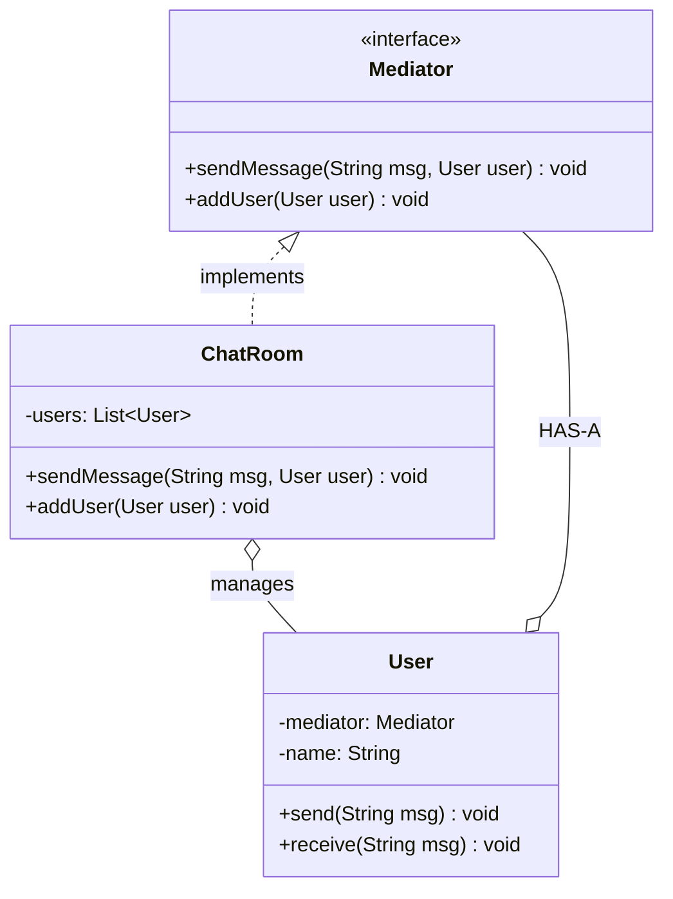

# Mediator

Central communication hub

Many-to-many via Mediator (hub-spoke pattern)

## Example
Chat room - users communicate through room

## UML Diagram



## Key Points

- Mediator HAS-MANY Colleagues (users)
- Colleagues HAS-A Mediator
- Reduces coupling between colleagues

## Code

```java
public interface Mediator {
    void sendMessage(String msg, User user);
    void addUser(User user);
}

public class ChatRoom implements Mediator {
    private List<User> users = new ArrayList<>();
    
    public void addUser(User user) {
        users.add(user);
    }
    
    public void sendMessage(String msg, User sender) {
        for (User user : users) {
            if (user != sender) {
                user.receive(msg);
            }
        }
    }
}

public class User {
    private Mediator mediator;
    private String name;
    
    public User(Mediator mediator, String name) {
        this.mediator = mediator;
        this.name = name;
    }
    
    public void send(String msg) {
        System.out.println(name + " sends: " + msg);
        mediator.sendMessage(msg, this);
    }
    
    public void receive(String msg) {
        System.out.println(name + " receives: " + msg);
    }
}

// Usage
ChatRoom chatRoom = new ChatRoom();

User user1 = new User(chatRoom, "Alice");
User user2 = new User(chatRoom, "Bob");

chatRoom.addUser(user1);
chatRoom.addUser(user2);

user1.send("Hello everyone!");  
// Bob receives the message
```

## When to use?

- Many-to-many communication needs coordination
- Want to reduce coupling between colleagues
- Complex communication needs centralization
