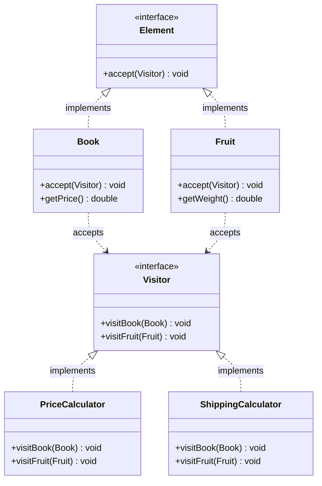

# Visitor

Add operations without changing classes

Visitor visits Elements (double dispatch)

## Example
Tax/Discount calculator visits Products

## UML Diagram



## Key Points

- Element accepts Visitor (double dispatch)
- Add new operations = new Visitor (no element change)
- Element hierarchy stable, operations vary

## Code

```java
public interface Visitor {
    void visitBook(Book book);
    void visitFruit(Fruit fruit);
}

public interface Element {
    void accept(Visitor visitor);
}

public class Book implements Element {
    private double price;
    
    public void accept(Visitor visitor) {
        visitor.visitBook(this);
    }
    
    public double getPrice() {
        return price;
    }
}

public class Fruit implements Element {
    private double weight;
    
    public void accept(Visitor visitor) {
        visitor.visitFruit(this);
    }
    
    public double getWeight() {
        return weight;
    }
}

public class PriceCalculator implements Visitor {
    private double total = 0;
    
    public void visitBook(Book book) {
        total += book.getPrice();
    }
    
    public void visitFruit(Fruit fruit) {
        total += fruit.getWeight() * 2.5;  // $2.5 per kg
    }
    
    public double getTotal() {
        return total;
    }
}

// Usage
List<Element> items = new ArrayList<>();
items.add(new Book());
items.add(new Fruit());

PriceCalculator calculator = new PriceCalculator();
for (Element item : items) {
    item.accept(calculator);
}

System.out.println("Total: " + calculator.getTotal());
```

## When to use?

- Need to add operations to stable element hierarchy
- Operations vary more than elements
- Open/Closed for operations, not elements
