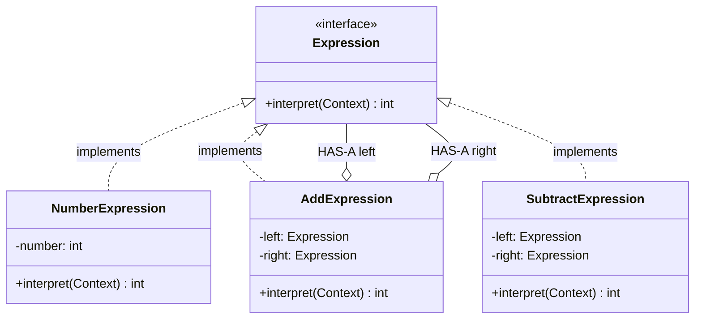

# Interpreter

Parse/evaluate language or expressions

Expression tree (Terminal + Non-Terminal)

## Example
Calculator: "3 + 5 * 2" → parse and evaluate

## UML Diagram



## Key Points

- Terminal expressions (leaves): NumberExpression
- Non-terminal expressions (operations): AddExpression
- Recursive evaluation of expression tree

## Code

```java
public interface Expression {
    int interpret();
}

public class NumberExpression implements Expression {
    private int number;
    
    public NumberExpression(int number) {
        this.number = number;
    }
    
    public int interpret() {
        return number;
    }
}

public class AddExpression implements Expression {
    private Expression left;
    private Expression right;
    
    public AddExpression(Expression left, Expression right) {
        this.left = left;
        this.right = right;
    }
    
    public int interpret() {
        return left.interpret() + right.interpret();
    }
}

public class SubtractExpression implements Expression {
    private Expression left;
    private Expression right;
    
    public SubtractExpression(Expression left, Expression right) {
        this.left = left;
        this.right = right;
    }
    
    public int interpret() {
        return left.interpret() - right.interpret();
    }
}

// Usage - Build expression tree for "5 + 3 - 2"
Expression five = new NumberExpression(5);
Expression three = new NumberExpression(3);
Expression two = new NumberExpression(2);

Expression add = new AddExpression(five, three);  // 5 + 3
Expression result = new SubtractExpression(add, two);  // (5 + 3) - 2

System.out.println(result.interpret());  // Output: 6
```

## When to use?

- Have grammar/rules to interpret
- Complex expressions need parsing
- Build abstract syntax tree (AST)
