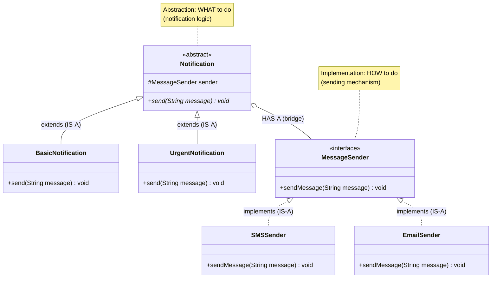

# Bridge Design Pattern

## What is Bridge Pattern?
Bridge decouples an abstraction from its implementation so that the two can vary independently. It separates "what" something does from "how" it does it.

**Key Idea:** Use composition instead of inheritance to connect abstraction and implementation.

---

## Why Use Bridge? (Problem it solves)

**Problem:**
- You have a class hierarchy that needs to extend in two independent dimensions
- Using inheritance creates an explosion of subclasses.
- Example: `Shape` (Circle, Square) × `Color` (Red, Blue) = 4 subclasses (RedCircle, BlueCircle, RedSquare, BlueSquare)
- Adding more shapes or colors multiplies the classes

**Solution:**
- Split the hierarchy into two: Abstraction (Shape) and Implementation (Color)
- Abstraction holds a reference to Implementation (composition, not inheritance)
- Both can vary independently without affecting each other

---

## Real-World Analogy

**TV and Remote Control:**
- **Abstraction:** Remote control (basic, advanced features)
- **Implementation:** TV brand (Sony, Samsung, LG)
- Remote doesn't inherit from TV — it holds a reference to TV
- You can use any remote with any TV (independent variation)
- Adding a new remote (e.g., voice control) doesn't require new TV classes
- Adding a new TV brand doesn't require new remote classes

---

## Simple Example (Notification System)

### UML Diagram: Bridge Pattern Relationships



Notes:
- Two hierarchies: Abstraction (Notification) and Implementation (MessageSender)
- Connected via HAS-A (bridge field)
- Vary WHAT (notification type) and HOW (sender) independently


### Relationship Explanations

**1. IS-A Relationships (Inheritance Hierarchies):**

**Abstraction Hierarchy:**
- `BasicNotification` **IS-A** `Notification` → extends abstract Notification
- `UrgentNotification` **IS-A** `Notification` → extends abstract Notification
- **Arrow:** Solid line with hollow triangle (inheritance/extends)
- **Purpose:** Different types of notifications (varying WHAT)

**Implementation Hierarchy:**
- `SMSSender` **IS-A** `MessageSender` → implements interface
- `EmailSender` **IS-A** `MessageSender` → implements interface
- **Arrow:** Dotted line with hollow triangle (implements/realizes)
- **Purpose:** Different sending mechanisms (varying HOW)

**2. HAS-A Relationship (The Bridge):**
- `Notification` **HAS-A** `MessageSender` → abstraction holds reference to implementation
- **This is the BRIDGE:** Connects abstraction hierarchy to implementation hierarchy
- **Arrow:** Hollow diamond (aggregation)
- **Key benefit:** Abstraction and implementation can vary INDEPENDENTLY

**3. Two Independent Dimensions:**

```
Dimension 1 (Abstraction - WHAT):    Dimension 2 (Implementation - HOW):
- BasicNotification                   - SMSSender
- UrgentNotification                  - EmailSender
- (ScheduledNotification)   - (add more: PushSender)
```

**Without Bridge (Inheritance explosion):**
```
BasicSMS, BasicEmail, UrgentSMS, UrgentEmail
→ N abstractions × M implementations = N×M classes
→ 2 × 2 = 4 classes (and growing!)
```

**With Bridge (Composition):**
```
2 abstraction classes + 2 implementation classes = 4 total classes
→ Can create 2 × 2 = 4 combinations WITHOUT 4 separate classes
→ Add 3rd sender? Still only 5 classes (not 6)
```

**4. Key Pattern Elements:**
- **Abstraction:** `Notification` — defines WHAT (high-level operations like `send()`)
- **Refined Abstraction:** `BasicNotification`, `UrgentNotification` — specializations of WHAT
- **Implementor:** `MessageSender` — defines HOW (low-level operations like `sendMessage()`)
- **Concrete Implementor:** `SMSSender`, `EmailSender` — specializations of HOW
- **Bridge:** The `sender` field in `Notification` — connects WHAT to HOW

**5. Delegation Flow:**

```
Client creates:
  MessageSender sms = new SMSSender();
  Notification notif = new UrgentNotification(sms);

Client calls:
  notif.send("System down!");

Execution flow:
  1. UrgentNotification.send() is called (WHAT logic)
  2. UrgentNotification adds prefix: "[URGENT] System down!"
  3. UrgentNotification delegates to: sender.sendMessage("[URGENT] System down!")
  4. SMSSender.sendMessage() is called (HOW logic)
  5. SMS is sent via SMS gateway
```

**6. Why Bridge Uses Composition (HAS-A):**

```
BAD: Inheritance
  class UrgentSMS extends Notification, SMSSender  // Multiple inheritance (not in Java)
  Problem: Tight coupling, can't change sender at runtime

GOOD: Composition (Bridge)
  class Notification { private MessageSender sender; }
  Benefit:
  - Can change sender: notification.setSender(new EmailSender())
  - Abstraction/Implementation vary independently
  - Add new notification type: doesn't affect senders
  - Add new sender: doesn't affect notification types
```


**8. Runtime Flexibility:**

```java
// Start with SMS
MessageSender sender = new SMSSender();
Notification notif = new UrgentNotification(sender);
notif.send("Alert!");  // Sends via SMS

// Later, switch to Email (same notification object)
notif.setSender(new EmailSender());  // If setter provided
notif.send("Alert!");  // Now sends via Email
```

```java
// Implementor interface: defines HOW messages are sent
public interface MessageSender {
    /*
     * This is the "implementation" side of the bridge.
     * Different senders implement this interface with their own logic.
     */
    void sendMessage(String message);
}

// Concrete Implementor 1: Send via SMS
public class SMSSender implements MessageSender {
    @Override
    public void sendMessage(String message) {
        System.out.println("SMS: " + message);
        // Real code: call SMS gateway API
    }
}

// Concrete Implementor 2: Send via Email
public class EmailSender implements MessageSender {
    @Override
    public void sendMessage(String message) {
        System.out.println("Email: " + message);
        // Real code: SMTP server connection
    }
}

// Abstraction: defines WHAT notifications do (high-level operations)
public abstract class Notification {
    /*
     * KEY: Abstraction holds a reference to the Implementor (composition).
     * This is the "bridge" — abstraction delegates to implementation.
     */
    protected MessageSender sender;  // Bridge to implementation
    
    public Notification(MessageSender sender) {
        this.sender = sender;
    }
    
    /*
     * Abstract method: different notification types can customize behavior.
     */
    public abstract void send(String message);
}

// Refined Abstraction 1: Basic notification
public class BasicNotification extends Notification {
    public BasicNotification(MessageSender sender) {
        super(sender);
    }
    
    @Override
    public void send(String message) {
        /*
         * Delegate to the implementation (sender).
         * Notification doesn't know if it's SMS or Email — sender handles it.
         */
        sender.sendMessage(message);
    }
}

// Refined Abstraction 2: Urgent notification (adds extra behavior)
public class UrgentNotification extends Notification {
    public UrgentNotification(MessageSender sender) {
        super(sender);
    }
    
    @Override
    public void send(String message) {
        /*
         * Add abstraction-specific behavior (urgent prefix).
         * Then delegate to implementation.
         */
        sender.sendMessage("[URGENT] " + message);
        sender.sendMessage("[URGENT] " + message);  // Send twice for urgency
    }
}

// Usage: Mix and match abstraction + implementation
public class BridgeDemo {
    public static void main(String[] args) {
        // Basic notification via SMS --- Basic SMS

        // BasicSMS bsms = 
        // UrgentSMS
        // BasicEMail
        // Urgent


        MessageSender smsSender = new SMSSender();
        Notification basicSMS = new BasicNotification(smsSender);


        basicSMS.send("Hello via SMS");
        // Output: SMS: Hello via SMS
        
        // Basic notification via Email
        MessageSender emailSender = new EmailSender();
        Notification basicEmail = new BasicNotification(emailSender);
        basicEmail.send("Hello via Email");
        // Output: Email: Hello via Email
        
        // Urgent notification via SMS
        Notification urgentSMS = new UrgentNotification(smsSender);
        urgentSMS.send("System down!");
        // Output:
        // SMS: [URGENT] System down!
        // SMS: [URGENT] System down!
        
        // Urgent notification via Email
        Notification urgentEmail = new UrgentNotification(emailSender);
        urgentEmail.send("Security alert");
        // Output:
        // Email: [URGENT] Security alert
        // Email: [URGENT] Security alert
    }
}
```