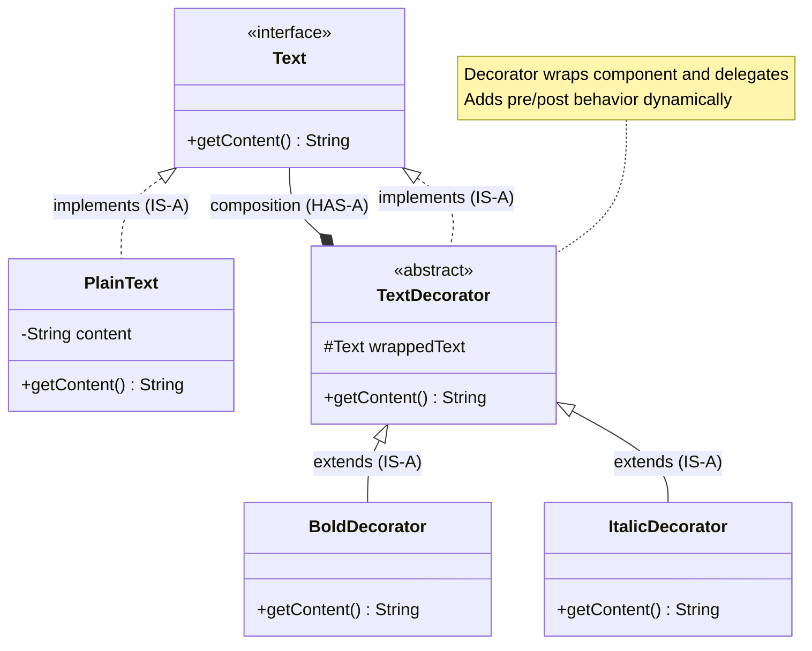

# Decorator Design Pattern

## What is Decorator Pattern?
Decorator attaches additional responsibilities to an object dynamically. It provides a flexible alternative to subclassing for extending functionality.

**Key Idea:** Wrap objects to add behavior without modifying their code.

---

## Real-World Analogy
**Coffee Shop:** Base coffee ($2) + Milk ($0.50) + Sugar ($0.25) + Whipped Cream ($0.75) = $3.50
- Each topping "decorates" the coffee, adding cost and description
- Can stack decorators: `WhippedCream(Sugar(Milk(Coffee)))`

---

## Simple Example (Text Formatting)

### UML Diagram: Decorator Pattern Relationships



Notes:
- Decorators implement the same interface as component (IS-A)
- Decorator composes a component (HAS-A) and delegates
- Stack multiple decorators to layer behavior


### Relationship Explanations

- IS-A (implements/extends): `PlainText` and `TextDecorator` implement `Text`; concrete decorators extend `TextDecorator` to stay substitutable for `Text`.
- HAS-A (composition): `TextDecorator` HAS-A `Text` (`wrappedText`) and delegates to it; stacking works because each decorator is also a `Text`.
- Open/Closed: Add new decorators without changing existing classes; compose behaviors at runtime.
- Order matters: `Italic(Bold(text))` ≠ `Bold(Italic(text))` — wrapping order changes result.

Delegation flow:
```
Client → new ItalicDecorator(new BoldDecorator(new PlainText("Hi")))
Italic.getContent() → Bold.getContent() → PlainText.getContent()
  Plain returns "Hi" → Bold adds <b> → Italic adds <i>
```

```java
// Component interface
public interface Text {
    String getContent();
}

// Concrete Component (base object)
public class PlainText implements Text {
    private String content;
    
    public PlainText(String content) {
        this.content = content;
    }
    
    @Override
    public String getContent() {
        return content;
    }
}

// Decorator base class
public abstract class TextDecorator implements Text {
    protected Text wrappedText;  // Component being decorated
    
    public TextDecorator(Text text) {
        this.wrappedText = text;
    }
    
    @Override
    public String getContent() {
        return wrappedText.getContent();  // Delegate to wrapped object
    }
}

// Concrete Decorator 1: Bold
public class BoldDecorator extends TextDecorator {
    public BoldDecorator(Text text) {
        super(text);
    }
    
    @Override
    public String getContent() {
        return "<b>" + super.getContent() + "</b>";  // Add bold tags
    }
}

// Concrete Decorator 2: Italic
public class ItalicDecorator extends TextDecorator {
    public ItalicDecorator(Text text) {
        super(text);
    }
    
    @Override
    public String getContent() {
        return "<i>" + super.getContent() + "</i>";
    }
}

// Usage: Stack decorators
public class DecoratorDemo {
    public static void main(String[] args) {
        Text text = new PlainText("Hello World");
        
        // Add bold
        Text boldText = new BoldDecorator(text);
        System.out.println(boldText.getContent());  // <b>Hello World</b>
        
        // Add bold + italic
        Text boldItalicText = new ItalicDecorator(new BoldDecorator(text));
        System.out.println(boldItalicText.getContent());  // <i><b>Hello World</b></i>
    }
}
```