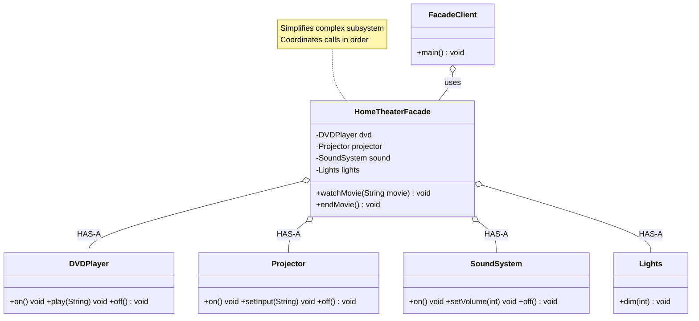

# Facade Design Pattern

## What is Facade Pattern?
Facade provides a simplified, unified interface to a complex subsystem. It makes the subsystem easier to use by hiding its complexity.

**Key Idea:** One simple interface that internally delegates to many complex objects.

---

## Real-World Analogy
**Car Ignition:** Turn key → starts engine (simple interface)
- Behind the scenes: fuel pump, spark plugs, battery, starter motor all coordinate
- You don't interact with each subsystem individually

---

## Simple Example (Home Theater System)

### UML Diagram: Facade Pattern Relationships



Notes:
- Facade HAS-A multiple subsystem objects
- Provides a simplified, unified interface for clients


### Relationship Explanations

- HAS-A (aggregation): Facade holds references to multiple subsystem classes and orchestrates them in the right order.
- No IS-A: Facade is not a subtype of any subsystem; it represents a new, simplified API for clients.
- Client coupling: Clients depend on the Facade, not individual subsystem classes (reduced coupling and simpler usage).
- Direct access allowed: Facade does not prevent direct use of subsystems; it’s a convenience entry point.

Call flow:
```
Client → HomeTheaterFacade.watchMovie("Inception")
    → lights.dim(10)
    → projector.on(); projector.setInput("DVD")
    → sound.on(); sound.setVolume(5)
    → dvd.on(); dvd.play("Inception")
```

# Code

```java
// Complex subsystem classes
public class DVDPlayer {
    public void on() { System.out.println("DVD Player ON"); }
    public void play(String movie) { System.out.println("Playing: " + movie); }
    public void off() { System.out.println("DVD Player OFF"); }
}

public class Projector {
    public void on() { System.out.println("Projector ON"); }
    public void setInput(String input) { System.out.println("Projector input: " + input); }
    public void off() { System.out.println("Projector OFF"); }
}

public class SoundSystem {
    public void on() { System.out.println("Sound System ON"); }
    public void setVolume(int level) { System.out.println("Volume: " + level); }
    public void off() { System.out.println("Sound System OFF"); }
}

public class Lights {
    public void dim(int level) { System.out.println("Lights dimmed to " + level + "%"); }
}

// Facade: Simplifies the complex subsystem
public class HomeTheaterFacade {
    private DVDPlayer dvd;
    private Projector projector;
    private SoundSystem sound;
    private Lights lights;
    
    public HomeTheaterFacade(DVDPlayer dvd, Projector projector, 
                             SoundSystem sound, Lights lights) {
        this.dvd = dvd;
        this.projector = projector;
        this.sound = sound;
        this.lights = lights;
    }
    
    // Simple interface: one method does everything
    public void watchMovie(String movie) {
        System.out.println("Get ready to watch a movie...");
        lights.dim(10);
        projector.on();
        projector.setInput("DVD");
        sound.on();
        sound.setVolume(5);
        dvd.on();
        dvd.play(movie);
    }
    
    public void endMovie() {
        System.out.println("Shutting down theater...");
        dvd.off();
        sound.off();
        projector.off();
        lights.dim(100);
    }
}

// Usage: Client uses simple facade
public class FacadeDemo {
    public static void main(String[] args) {
        // Without Facade: Client must manage all subsystems
        // dvd.on(); projector.on(); projector.setInput("DVD"); ...
        
        // With Facade: Simple interface
        DVDPlayer dvd = new DVDPlayer();
        Projector projector = new Projector();
        SoundSystem sound = new SoundSystem();
        Lights lights = new Lights();
        
        HomeTheaterFacade homeTheater = new HomeTheaterFacade(dvd, projector, sound, lights);
        
        homeTheater.watchMovie("Inception");
        System.out.println();
        homeTheater.endMovie();
    }
}
```