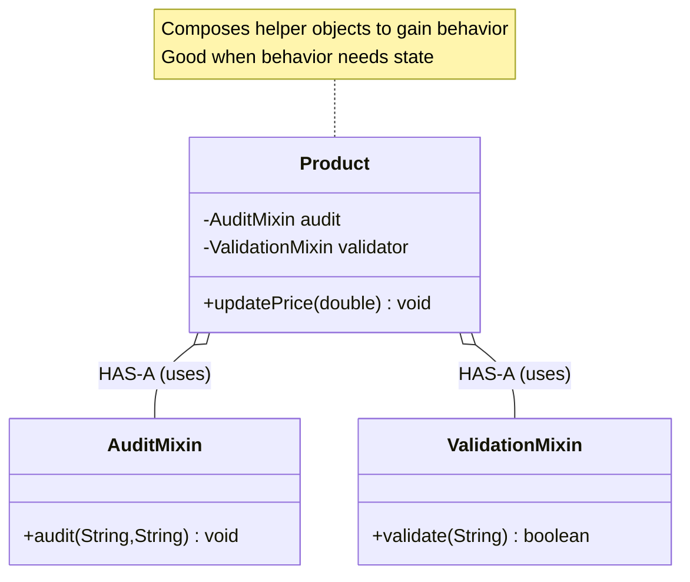

# Mixin Design Pattern

## What is Mixin Pattern?
Mixin is a way to add reusable functionality to classes through composition or interfaces with default methods (Java 8+). It provides multiple inheritance of behavior without traditional class inheritance.

**Key Idea:** Mix in behavior from multiple sources without deep inheritance hierarchies.

---

## Real-World Analogy
**Smartphone Features:** Base phone + Camera mixin + GPS mixin + Music player mixin
- Each mixin adds independent feature
- Not all phones have all features
- Can mix and match features without inheritance explosion

### UML Diagram: Mixin Relationships (Java approaches)

```mermaid
classDiagram
    %% Interface-default-methods approach
    class Loggable { <<interface>> +log(String) void }
    class Timestampable { <<interface>> +getTimestamp() String +printWithTimestamp(String) void }
    class Serializable { <<interface>> +serialize() String }
    class Order { +process() void }
    class User { +login() void }
    
    Loggable <|.. Order : implements (IS-A)
    Timestampable <|.. Order : implements (IS-A)
    Serializable <|.. Order : implements (IS-A)
    Loggable <|.. User : implements (IS-A)
    Timestampable <|.. User : implements (IS-A)
    
    note "Interfaces with default methods provide reusable behavior<br/>(no state); classes implement multiple mixins" as N1
```

Notes:
- Classes implement multiple mixin interfaces to gain behavior (methods)
- Default methods provide reusable behavior without state
```



### Relationship Explanations

- IS-A (implements): Classes like `Order` and `User` implement mixin interfaces (`Loggable`, `Timestampable`, etc.), gaining behavior via default methods.
- HAS-A (composition): Classes like `Product` HAVE mixin helper objects (`AuditMixin`, `ValidationMixin`) when behavior requires state.
- Behavior reuse: Mixins add methods without deep inheritance; combine multiple behaviors à la carte.
- Java constraint: No multiple class inheritance; mixins via interfaces or composition are idiomatic.

---

## Java Approach: Interface Default Methods 

```java
// Mixin 1: Logging capability
public interface Loggable {
    // Default method provides mixin behavior
    default void log(String message) {
        System.out.println("[LOG] " + getClass().getSimpleName() + ": " + message);
    }
}

// Mixin 2: Timestamping capability
public interface Timestampable {
    default String getTimestamp() {
        return java.time.LocalDateTime.now().toString();
    }
    
    default void printWithTimestamp(String message) {
        System.out.println("[" + getTimestamp() + "] " + message);
    }
}

// Mixin 3: Serialization capability
public interface Serializable {
    default String serialize() {
        return "Serialized: " + this.toString();
    }
}

// Class can mix in multiple behaviors
public class Order implements Loggable, Timestampable, Serializable {
    private String orderId;
    private double amount;
    
    public Order(String orderId, double amount) {
        this.orderId = orderId;
        this.amount = amount;
    }
    
    public void process() {
        log("Processing order");  // From Loggable mixin
        printWithTimestamp("Order amount: $" + amount);  // From Timestampable mixin
        System.out.println(serialize());  // From Serializable mixin
    }
    
    @Override
    public String toString() {
        return "Order{id=" + orderId + ", amount=" + amount + "}";
    }
}

// Another class mixes in different behaviors
public class User implements Loggable, Timestampable {
    // No Serializable mixin
    private String username;
    
    public User(String username) {
        this.username = username;
    }
    
    public void login() {
        log("User logged in");  // Has Loggable
        printWithTimestamp("Login successful");  // Has Timestampable
        // No serialize() method (doesn't implement Serializable)
    }
}

// Usage
public class MixinDemo {
    public static void main(String[] args) {
        Order order = new Order("ORD-123", 99.99);
        order.process();
        
        System.out.println();
        
        User user = new User("alice");
        user.login();
        
        /* Output:
         * [LOG] Order: Processing order
         * [2025-12-02T10:30:45.123] Order amount: $99.99
         * Serialized: Order{id=ORD-123, amount=99.99}
         * 
         * [LOG] User: User logged in
         * [2025-12-02T10:30:45.150] Login successful
         */
    }
}
```