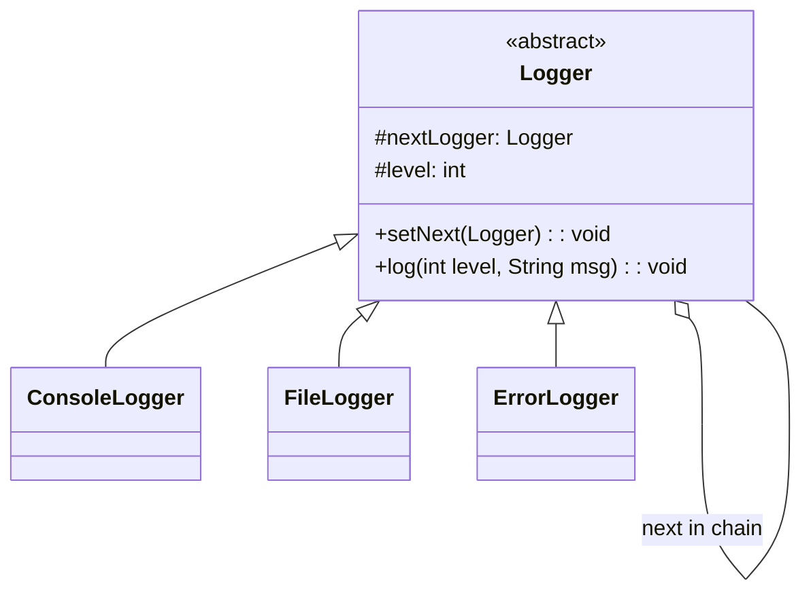

# Chain of Responsibility Design Pattern

## What is Chain of Responsibility?
Chain of Responsibility passes a request along a chain of handlers. Each handler decides either to process the request or pass it to the next handler in the chain.

**Key Idea:** Decouple sender from receiver by giving multiple objects a chance to handle the request.

---

## Why Use Chain of Responsibility? (Problem it solves)

**Problem:**
- You have multiple processors that can handle a request
- You don't know in advance which processor should handle it
- You want to avoid coupling sender to all possible receivers
- Without pattern: sender needs if-else chains checking which handler to use

**Solution:**
- Chain handlers in a linked list
- Each handler decides: handle it OR pass to next
- Sender only knows the first handler (entry point)

---

## Real-World Analogy

**Customer Support:**
- Level 1: Basic questions → if can't solve, escalate to Level 2
- Level 2: Technical issues → if can't solve, escalate to Level 3
- Level 3: Senior engineer → handles complex issues
- You don't need to know who will solve your problem, just start at Level 1

---

## Simple Example (Logging System)

### UML Diagram: Chain of Responsibility Relationships



### Relationship Explanations

**1. IS-A Relationships (Inheritance):**
- `ConsoleLogger` **IS-A** `Logger` → extends abstract Logger
- `FileLogger` **IS-A** `Logger` → extends abstract Logger
- `ErrorLogger` **IS-A** `Logger` → extends abstract Logger
- **Purpose:** All handlers share common interface and chaining logic

**2. HAS-A Relationship (The Chain):**
- `Logger` **HAS-A** `Logger` → each handler holds reference to next handler
- **Key:** Self-referential HAS-A creates the chain
- **Arrow:** Hollow diamond (aggregation) — next handler exists independently

**3. Chain Structure:**
```
Request → Handler1 → Handler2 → Handler3 → null
          ↓ handle?   ↓ handle?   ↓ handle?
          or pass     or pass     or pass
```

- Chain is built dynamically via `setNext()`
- Request flows through chain until handled or reaches end
- Handlers can process AND pass to next (not mutually exclusive)

```java
// Handler interface
public abstract class Logger {
    public static int INFO = 1;
    public static int DEBUG = 2;
    public static int ERROR = 3;
    
    protected int level;  // What level this handler processes
    protected Logger nextLogger;  // Next handler in chain
    
    public void setNext(Logger next) {
        this.nextLogger = next;
    }
    
    /*
     * KEY METHOD: Check if this handler can process, 
     * otherwise pass to next in chain.
     */
    public void log(int level, String message) {
        if (this.level <= level) {
            write(message);  // This handler processes it
        }
        // Pass to next handler (if exists) regardless of whether we handled it
        if (nextLogger != null) {
            nextLogger.log(level, message);
        }
    }
    
    // Subclasses implement how they write logs
    protected abstract void write(String message);
}

// Concrete Handler 1: Console Logger
public class ConsoleLogger extends Logger {
    public ConsoleLogger(int level) {
        this.level = level;
    }
    
    @Override
    protected void write(String message) {
        System.out.println("Console: " + message);
    }
}

// Concrete Handler 2: File Logger
public class FileLogger extends Logger {
    public FileLogger(int level) {
        this.level = level;
    }
    
    @Override
    protected void write(String message) {
        System.out.println("File: " + message);
    }
}

// Concrete Handler 3: Error Logger
public class ErrorLogger extends Logger {
    public ErrorLogger(int level) {
        this.level = level;
    }
    
    @Override
    protected void write(String message) {
        System.out.println("Error: " + message);
    }
}

// Usage: Build the chain
public class ChainDemo {
    private static Logger getChainOfLoggers() {
        // Create handlers
        Logger errorLogger = new ErrorLogger(Logger.ERROR);
        Logger fileLogger = new FileLogger(Logger.DEBUG);
        Logger consoleLogger = new ConsoleLogger(Logger.INFO);
        
        // Build chain: console → file → error
        consoleLogger.setNext(fileLogger);
        fileLogger.setNext(errorLogger);
        
        return consoleLogger;  // Return first handler (entry point)
    }
    
    public static void main(String[] args) {
        Logger chain = getChainOfLoggers();
        
        chain.log(Logger.INFO, "This is an info message");
        System.out.println();
        chain.log(Logger.DEBUG, "This is a debug message");
        System.out.println();
        chain.log(Logger.ERROR, "This is an error message");
        
        /* Output:
         * Console: This is an info message
         * 
         * Console: This is a debug message
         * File: This is a debug message
         * 
         * Console: This is an error message
         * File: This is an error message
         * Error: This is an error message
         */
    }
}
```

**How the Code Works (Step-by-step Flow):**

1. **Chain Setup:**
   ```
   consoleLogger (level=1) → fileLogger (level=2) → errorLogger (level=3) → null
   ```

2. **First call: `chain.log(Logger.INFO, "This is an info message")`** (INFO=1)
   - ConsoleLogger: `1 <= 1`  → writes "Console: This is an info message"
   - ConsoleLogger passes to FileLogger
   - FileLogger: `2 <= 1`  → skips writing, passes to ErrorLogger
   - ErrorLogger: `3 <= 1`  → skips writing, no next handler
   - **Result:** Only console logs

3. **Second call: `chain.log(Logger.DEBUG, "This is a debug message")`** (DEBUG=2)
   - ConsoleLogger: `1 <= 2` → writes "Console: This is a debug message"
   - ConsoleLogger passes to FileLogger
   - FileLogger: `2 <= 2`  → writes "File: This is a debug message"
   - FileLogger passes to ErrorLogger
   - ErrorLogger: `3 <= 2`  → skips writing
   - **Result:** Console + File log

4. **Third call: `chain.log(Logger.ERROR, "This is an error message")`** (ERROR=3)
   - ConsoleLogger: `1 <= 3` → writes "Console: This is an error message"
   - ConsoleLogger passes to FileLogger
   - FileLogger: `2 <= 3` → writes "File: This is an error message"
   - FileLogger passes to ErrorLogger
   - ErrorLogger: `3 <= 3` → writes "Error: This is an error message"
   - **Result:** All three log

**Key Insight:** Each handler processes AND forwards. Higher priority messages cascade through more handlers.


---

## E-commerce Example (Order Discount Chain)

```java
// Abstract Handler
public abstract class DiscountHandler {
    protected DiscountHandler next;
    
    public void setNext(DiscountHandler next) {
        this.next = next;
    }
    
    /*
     * Each handler checks if it can apply discount.
     * If yes, apply it. Then pass to next handler.
     */
    public abstract double applyDiscount(double price, String customerType, int quantity);
}

// Handler 1: Member Discount (10% for members)
public class MemberDiscountHandler extends DiscountHandler {
    @Override
    public double applyDiscount(double price, String customerType, int quantity) {
        if ("MEMBER".equals(customerType)) {
            System.out.println("Applying member discount: 10%");
            price = price * 0.9;
        }
        
        // Pass to next handler
        if (next != null) {
            return next.applyDiscount(price, customerType, quantity);
        }
        return price;
    }
}

// Handler 2: Bulk Discount (5% for qty > 10)
public class BulkDiscountHandler extends DiscountHandler {
    @Override
    public double applyDiscount(double price, String customerType, int quantity) {
        if (quantity > 10) {
            System.out.println("Applying bulk discount: 5%");
            price = price * 0.95;
        }
        
        if (next != null) {
            return next.applyDiscount(price, customerType, quantity);
        }
        return price;
    }
}

// Handler 3: Seasonal Discount (15% during sale)
public class SeasonalDiscountHandler extends DiscountHandler {
    private boolean isSaleSeason;
    
    public SeasonalDiscountHandler(boolean isSaleSeason) {
        this.isSaleSeason = isSaleSeason;
    }
    
    @Override
    public double applyDiscount(double price, String customerType, int quantity) {
        if (isSaleSeason) {
            System.out.println("Applying seasonal discount: 15%");
            price = price * 0.85;
        }
        
        if (next != null) {
            return next.applyDiscount(price, customerType, quantity);
        }
        return price;
    }
}

// Usage
public class OrderPricingDemo {
    public static void main(String[] args) {
        // Build discount chain
        DiscountHandler memberDiscount = new MemberDiscountHandler();
        DiscountHandler bulkDiscount = new BulkDiscountHandler();
        DiscountHandler seasonalDiscount = new SeasonalDiscountHandler(true);
        
        memberDiscount.setNext(bulkDiscount);
        bulkDiscount.setNext(seasonalDiscount);
        
        // Calculate price with all applicable discounts
        double originalPrice = 1000.0;
        double finalPrice = memberDiscount.applyDiscount(originalPrice, "MEMBER", 15);
        
        System.out.println("Original: $" + originalPrice);
        System.out.println("Final: $" + finalPrice);
        
        /* Output:
         * Applying member discount: 10%
         * Applying bulk discount: 5%
         * Applying seasonal discount: 15%
         * Original: $1000.0
         * Final: $728.775  (90% * 95% * 85% of 1000)
         */
    }
}
```

**How the Code Works (Step-by-step Flow):**

1. **Chain Setup:**
   ```
   MemberDiscount → BulkDiscount → SeasonalDiscount → null
   ```

2. **Initial Call:** `memberDiscount.applyDiscount(1000.0, "MEMBER", 15)`

3. **Handler 1: MemberDiscountHandler**
   - Check: `customerType == "MEMBER"` 
   - Action: `price = 1000 * 0.9 = 900`
   - Print: "Applying member discount: 10%"
   - Pass modified price to next: `bulkDiscount.applyDiscount(900, "MEMBER", 15)`

4. **Handler 2: BulkDiscountHandler**
   - Receive: price = 900
   - Check: `quantity > 10` → `15 > 10` 
   - Action: `price = 900 * 0.95 = 855`
   - Print: "Applying bulk discount: 5%"
   - Pass modified price to next: `seasonalDiscount.applyDiscount(855, "MEMBER", 15)`

5. **Handler 3: SeasonalDiscountHandler**
   - Receive: price = 855
   - Check: `isSaleSeason == true` 
   - Action: `price = 855 * 0.85 = 726.75`
   - Print: "Applying seasonal discount: 15%"
   - No next handler, return: 726.75

6. **Final Return:** Price bubbles back through chain: 726.75 → 726.75 → 726.75 → **$728.775** (displayed)

**Key Insight:** Unlike logger example, each handler **modifies** the price and passes modified value. Discounts stack multiplicatively.

---

## When to Use Chain of Responsibility

**Use when:**
- Multiple objects may handle a request, but handler isn't known beforehand
- Want to decouple sender from receivers
- Set of handlers varies dynamically
- Example: approval workflows, event handling, logging levels

**Don't use when:**
- Only one handler exists (use direct call)
- You know exactly which handler to use (use Factory or Strategy)
- Every request must be handled (chain might drop requests if no handler matches)

---

End of Chain of Responsibility Pattern
