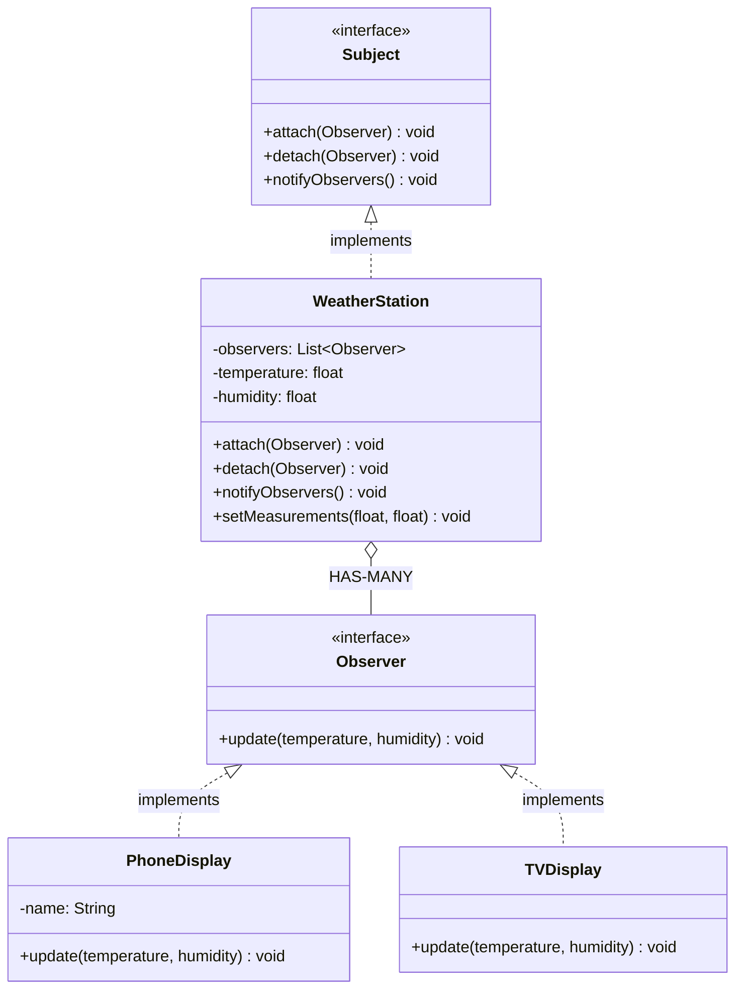

# Observer Design Pattern

## What is Observer Pattern?
Observer defines a one-to-many dependency between objects so that when one object (Subject) changes state, all its dependents (Observers) are notified automatically.

**Key Idea:** Publish-subscribe mechanism where observers register with subject to receive updates.

---

## Why Use Observer? (Problem it solves)

**Problem:**
- One object's state changes affect multiple other objects
- Don't want tight coupling between subject and dependents
- Number of dependents may vary dynamically

**Solution:**
- Subject maintains list of observers
- Observers register/unregister with subject
- When subject changes, it notifies all observers
- Observers pull or receive data from subject

---

## Real-World Analogy

**YouTube Channel:**
- Channel (subject) posts new video
- Subscribers (observers) get notified automatically
- You can subscribe/unsubscribe anytime
- Channel doesn't need to know who subscribers are

---

## Simple Example (Weather Station)

### UML Diagram: Observer Pattern Relationships



### Relationship Explanations

**1. IS-A Relationships:**
- `WeatherStation` **IS-A** `Subject` → implements subject interface
- `PhoneDisplay` **IS-A** `Observer` → implements observer interface
- `TVDisplay` **IS-A** `Observer` → implements observer interface

**2. HAS-A Relationship:**
- `WeatherStation` **HAS-MANY** `Observer` → subject holds list of observers
- **Key:** One-to-many relationship, subject broadcasts to all

**3. Notification Flow:**
```
1. Observer1.attach(subject) → registers
2. Observer2.attach(subject) → registers
3. Subject.setState(newValue) → state changes
4. Subject.notifyObservers() → loops through observers
5. Each observer.update(data) → receives notification
```

- Subject doesn't know concrete observer types (loose coupling)
- Observers can be added/removed dynamically
- Push model (subject sends data) vs Pull model (observer requests data)

```java
// Observer interface
public interface Observer {
    void update(float temperature, float humidity);
}

// Subject interface
public interface Subject {
    void attach(Observer observer);
    void detach(Observer observer);
    void notifyObservers();
}

// Concrete Subject: Weather Station
public class WeatherStation implements Subject {
    private List<Observer> observers = new ArrayList<>();
    private float temperature;
    private float humidity;
    
    @Override
    public void attach(Observer observer) {
        observers.add(observer);
        System.out.println("Observer attached");
    }
    
    @Override
    public void detach(Observer observer) {
        observers.remove(observer);
        System.out.println("Observer detached");
    }
    
    @Override
    public void notifyObservers() {
        // Notify all registered observers
        for (Observer observer : observers) {
            observer.update(temperature, humidity);
        }
    }
    
    // When state changes, notify observers
    public void setMeasurements(float temperature, float humidity) {
        this.temperature = temperature;
        this.humidity = humidity;
        notifyObservers();  // Trigger notifications
    }
}

// Concrete Observer 1: Phone Display
public class PhoneDisplay implements Observer {
    private String name;
    
    public PhoneDisplay(String name) {
        this.name = name;
    }
    
    @Override
    public void update(float temperature, float humidity) {
        System.out.println(name + " - Temp: " + temperature + "°C, Humidity: " + humidity + "%");
    }
}

// Concrete Observer 2: TV Display
public class TVDisplay implements Observer {
    @Override
    public void update(float temperature, float humidity) {
        System.out.println("[TV] Weather Update: " + temperature + "°C, " + humidity + "%");
    }
}

// Usage
public class ObserverDemo {
    public static void main(String[] args) {
        WeatherStation station = new WeatherStation();
        
        Observer phoneDisplay = new PhoneDisplay("Phone");
        Observer tvDisplay = new TVDisplay();
        
        // Register observers
        station.attach(phoneDisplay);
        station.attach(tvDisplay);
        
        // Update weather (notifies all observers)
        System.out.println("\nWeather update 1:");
        station.setMeasurements(25.5f, 65.0f);
        
        // Detach one observer
        station.detach(phoneDisplay);
        
        System.out.println("\nWeather update 2:");
        station.setMeasurements(28.0f, 70.0f);  // Only TV notified
    }
}
```

**How the Code Works (Step-by-step Flow):**

1. **Setup:**
   - Create Subject: `WeatherStation station`
   - Create Observers: `phoneDisplay`, `tvDisplay`
   - Register: `station.attach(phoneDisplay)`, `station.attach(tvDisplay)`
   - Observers list: `[phoneDisplay, tvDisplay]`

2. **First Update: `station.setMeasurements(25.5f, 65.0f)`**
   - Sets: temp = 25.5, humidity = 65.0
   - Calls: `notifyObservers()`
   - Loops through observers:
     - `phoneDisplay.update(25.5, 65.0)` → prints "Phone - Temp: 25.5°C, Humidity: 65%"
     - `tvDisplay.update(25.5, 65.0)` → prints "[TV] Weather Update: 25.5°C, 65%"

3. **Detach Observer:**
   - `station.detach(phoneDisplay)`
   - Observers list: `[tvDisplay]`

4. **Second Update: `station.setMeasurements(28.0f, 70.0f)`**
   - Sets: temp = 28.0, humidity = 70.0
   - Calls: `notifyObservers()`
   - Loops through observers:
     - Only `tvDisplay.update(28.0, 70.0)` → prints "[TV] Weather Update: 28.0°C, 70%"
     - phoneDisplay not notified (detached)

**Key Insight:** Observers can be added/removed dynamically. Subject broadcasts to all registered observers without knowing their types.


---

## E-commerce Example (Product Stock Notification)

```java
// Observer interface
public interface StockObserver {
    void onStockAvailable(String productId, int quantity);
}

// Subject: Product Inventory
public class ProductInventory {
    private Map<String, Integer> stock = new HashMap<>();
    private Map<String, List<StockObserver>> observers = new HashMap<>();
    
    // Subscribe to product notifications
    public void subscribe(String productId, StockObserver observer) {
        observers.computeIfAbsent(productId, k -> new ArrayList<>()).add(observer);
        System.out.println("Observer subscribed to " + productId);
    }
    
    // Unsubscribe
    public void unsubscribe(String productId, StockObserver observer) {
        List<StockObserver> productObservers = observers.get(productId);
        if (productObservers != null) {
            productObservers.remove(observer);
        }
    }
    
    // Notify observers of specific product
    private void notifyObservers(String productId, int quantity) {
        List<StockObserver> productObservers = observers.get(productId);
        if (productObservers != null) {
            for (StockObserver observer : productObservers) {
                observer.onStockAvailable(productId, quantity);
            }
        }
    }
    
    // Update stock (triggers notification if product was out of stock)
    public void updateStock(String productId, int quantity) {
        int oldStock = stock.getOrDefault(productId, 0);
        stock.put(productId, quantity);
        
        // Notify if product back in stock
        if (oldStock == 0 && quantity > 0) {
            System.out.println("\n" + productId + " back in stock!");
            notifyObservers(productId, quantity);
        }
    }
}

// Concrete Observer 1: Email Notifier
public class EmailNotifier implements StockObserver {
    private String userEmail;
    
    public EmailNotifier(String userEmail) {
        this.userEmail = userEmail;
    }
    
    @Override
    public void onStockAvailable(String productId, int quantity) {
        System.out.println("Email sent to " + userEmail + ": " + productId + " is back in stock (" + quantity + " units)");
    }
}

// Concrete Observer 2: SMS Notifier
public class SMSNotifier implements StockObserver {
    private String phoneNumber;
    
    public SMSNotifier(String phoneNumber) {
        this.phoneNumber = phoneNumber;
    }
    
    @Override
    public void onStockAvailable(String productId, int quantity) {
        System.out.println("SMS sent to " + phoneNumber + ": " + productId + " available");
    }
}

// Usage
public class StockNotificationDemo {
    public static void main(String[] args) {
        ProductInventory inventory = new ProductInventory();

        ProductInventory AppleMacBookInventory = new ProductInventory();
        StockObserver emailObserverForSupriyo = new EmailNotifier("user@example.com");
        
        
        StockObserver emailObserver = new EmailNotifier("user@example.com");
        StockObserver smsObserver = new SMSNotifier("+1234567890");
        
        // Users subscribe to product notifications
        inventory.subscribe("LAPTOP-001", emailObserver);
        inventory.subscribe("LAPTOP-001", smsObserver);

        inventory.subscribe("LAPTOP-001", emailObserverForSupriyo);
        
        // Product out of stock initially
        inventory.updateStock("LAPTOP-001", 0);
        
        // Product back in stock → notify all subscribers
        inventory.updateStock("LAPTOP-001", 10);
        
        /* Output:
         * Observer subscribed to LAPTOP-001
         * Observer subscribed to LAPTOP-001
         * 
         * LAPTOP-001 back in stock!
         * Email sent to user@example.com: LAPTOP-001 is back in stock (10 units)
         * SMS sent to +1234567890: LAPTOP-001 available
         */
    }
}
```

Call Flow:
Inventory Class Function UpdateStock - Inventory Class NotifyObservers - Calls OnStockAvailable method from perticular Observer (EmailNotifier or SMS Notifier)

Subject : Whom we are tracking/Oberving
Observer: Subscribing for updates for subjects.

If someone updates the Subject, then the Observer will get notified.

---

## When to Use Observer

**Use when:**
- One object's changes should trigger updates in others
- Number of dependents unknown or varies dynamically
- Want loose coupling between subject and observers
- Example: event systems, MVC, notifications, real-time dashboards

**Don't use when:**
- Only one observer exists (direct call is simpler)
- Tight coupling is acceptable
- Order of notifications matters (Observer doesn't guarantee order)

---

End of Observer Pattern
