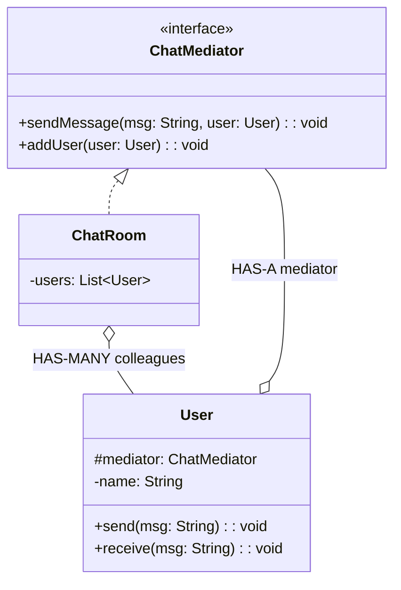

# Mediator Design Pattern

## What is Mediator Pattern?
Mediator defines an object that encapsulates how a set of objects interact. It promotes loose coupling by keeping objects from referring to each other explicitly.

**Key Idea:** Instead of objects communicating directly (many-to-many), they communicate through a central mediator (hub-and-spoke).

---

## Why Use Mediator? (Problem it solves)

**Problem:**
- Multiple objects interact with each other (complex web of dependencies)
- Direct references create tight coupling (hard to change or reuse)
- Adding/removing objects requires changing many classes

**Solution:**
- Create a Mediator that handles all inter-object communication
- Objects only know the Mediator, not each other
- Centralized control logic in one place

---

## Real-World Analogy

**Air Traffic Control:**
- Planes don't communicate directly with each other (chaos!)
- All planes talk to control tower (mediator)
- Control tower coordinates takeoff/landing/routing
- Adding a new plane doesn't require all planes to know about it

---

## Simple Example (Chat Room)

### UML Diagram: Mediator Pattern Relationships



### Relationship Explanations

**1. IS-A Relationships:**
- `ChatRoom` **IS-A** `ChatMediator` → implements mediator interface

**2. HAS-A Relationships (The Key):**
- `User` **HAS-A** `ChatMediator` → colleague knows mediator
- `ChatRoom` **HAS-MANY** `User` → mediator knows all colleagues
- **Key:** Users don't know each other, only know mediator

**3. Communication Flow:**
```
Without Mediator (tight coupling):
User1 ←→ User2
  ↕       ↕
User3 ←→ User4

With Mediator (loose coupling):
User1 → Mediator → User2
User3 →    ↓     → User4
```

- Mediator centralizes communication logic
- Colleagues decoupled from each other
- Easy to add new colleagues without changing existing ones

```java
// Mediator interface
public interface ChatMediator {
    void sendMessage(String message, User user);
    void addUser(User user);
}

// Concrete Mediator
public class ChatRoom implements ChatMediator {
    private List<User> users = new ArrayList<>();
    
    @Override
    public void addUser(User user) {
        users.add(user);
    }
    
    @Override
    public void sendMessage(String message, User sender) {
        // Send message to all users except sender
        for (User user : users) {
            if (user != sender) {
                user.receive(message);
            }
        }
    }
}

// Colleague: User
public class User {
    protected ChatMediator mediator;
    protected String name;
    
    public User(ChatMediator mediator, String name) {
        this.mediator = mediator;
        this.name = name;
    }
    
    public void send(String message) {
        System.out.println(name + " sends: " + message);
        mediator.sendMessage(message, this);  // Talk to mediator, not other users
    }
    
    public void receive(String message) {
        System.out.println(name + " receives: " + message);
    }
    
    public String getName() { return name; }
}

// Usage
public class MediatorDemo {
    public static void main(String[] args) {
        ChatMediator chatRoom = new ChatRoom();
        
        User user1 = new User(chatRoom, "Ram");
        User user2 = new User(chatRoom, "Shyam");
        User user3 = new User(chatRoom, "Baburao");
        
        chatRoom.addUser(user1);
        chatRoom.addUser(user2);
        chatRoom.addUser(user3);
        
        user1.send("Hello everyone!");
        
        /* Output:
         * Ram sends: Hello everyone!
         * Shyam receives: Hello everyone!
         * Baburao receives: Hello everyone!
         */
    }
}
```

**How the Code Works (Step-by-step Flow):**

1. **Setup Phase:**
   - Create Mediator: `ChatRoom chatRoom = new ChatRoom()`
   - Create Colleagues:
     - `user1 = new User(chatRoom, "Ram")` → user1 knows chatRoom
     - `user2 = new User(chatRoom, "Shyam")` → user2 knows chatRoom
     - `user3 = new User(chatRoom, "Baburao")` → user3 knows chatRoom
   - Register users: `chatRoom.addUser(user1/2/3)` → chatRoom knows all users

2. **Sending Message: `user1.send("Hello everyone!")`**
   - `User.send()` prints: "Ram sends: Hello everyone!"
   - Calls: `mediator.sendMessage("Hello everyone!", user1)`
   - `ChatRoom.sendMessage()` loops through all users:
     - Skips sender (user1)
     - Calls `user2.receive("Hello everyone!")` → prints "Shyam receives: Hello everyone!"
     - Calls `user3.receive("Hello everyone!")` → prints "Baburao receives: Hello everyone!"

**Key Insight:** 
- Users never call each other directly (decoupled)
- Mediator handles routing logic (who receives what)
- Flow: User → Mediator → Other Users (hub-and-spoke)


---

## E-commerce Example (Order Checkout Mediator)

```java
// Mediator interface
public interface CheckoutMediator {
    void notifyInventoryReserved(String orderId);
    void notifyPaymentProcessed(String orderId);
    void notifyShippingArranged(String orderId);
}

// Concrete Mediator: Orchestrates checkout flow
public class CheckoutCoordinator implements CheckoutMediator {
    private InventoryService inventory;
    private PaymentService payment;
    private ShippingService shipping;
    private NotificationService notification;
    
    public CheckoutCoordinator(InventoryService inventory, 
                              PaymentService payment,
                              ShippingService shipping,
                              NotificationService notification) {
        this.inventory = inventory;
        this.payment = payment;
        this.shipping = shipping;
        this.notification = notification;
        
        // Services know about mediator
        inventory.setMediator(this);
        payment.setMediator(this);
        shipping.setMediator(this);
    }
    
    @Override
    public void notifyInventoryReserved(String orderId) {
        System.out.println("Mediator: Inventory reserved for " + orderId);
        payment.processPayment(orderId);  // Trigger next step
    }
    
    @Override
    public void notifyPaymentProcessed(String orderId) {
        System.out.println("Mediator: Payment processed for " + orderId);
        shipping.arrangeShipping(orderId);  // Trigger next step
    }
    
    @Override
    public void notifyShippingArranged(String orderId) {
        System.out.println("Mediator: Shipping arranged for " + orderId);
        notification.sendConfirmation(orderId);  // Final step
    }
    
    public void startCheckout(String orderId) {
        inventory.reserveStock(orderId);  // Start the workflow
    }
}

// Colleague 1: Inventory Service
public class InventoryService {
    private CheckoutMediator mediator;
    
    public void setMediator(CheckoutMediator mediator) {
        this.mediator = mediator;
    }
    
    public void reserveStock(String orderId) {
        System.out.println("InventoryService: Reserving stock for " + orderId);
        mediator.notifyInventoryReserved(orderId);  // Notify mediator
    }
}

// Colleague 2: Payment Service
public class PaymentService {
    private CheckoutMediator mediator;
    
    public void setMediator(CheckoutMediator mediator) {
        this.mediator = mediator;
    }
    
    public void processPayment(String orderId) {
        System.out.println("PaymentService: Processing payment for " + orderId);
        mediator.notifyPaymentProcessed(orderId);
    }
}

// Colleague 3: Shipping Service
public class ShippingService {
    private CheckoutMediator mediator;
    
    public void setMediator(CheckoutMediator mediator) {
        this.mediator = mediator;
    }
    
    public void arrangeShipping(String orderId) {
        System.out.println("ShippingService: Arranging shipping for " + orderId);
        mediator.notifyShippingArranged(orderId);
    }
}

// Colleague 4: Notification Service
public class NotificationService {
    public void sendConfirmation(String orderId) {
        System.out.println("NotificationService: Sending confirmation for " + orderId);
    }
}

// Usage
public class CheckoutMediatorDemo {
    public static void main(String[] args) {
        InventoryService inventory = new InventoryService();
        PaymentService payment = new PaymentService();
        ShippingService shipping = new ShippingService();
        NotificationService notification = new NotificationService();
        
        CheckoutMediator coordinator = new CheckoutCoordinator(
            inventory, payment, shipping, notification
        );
        
        coordinator.startCheckout("ORD-123");
        
        /* Output:
         * InventoryService: Reserving stock for ORD-123
         * Mediator: Inventory reserved for ORD-123
         * PaymentService: Processing payment for ORD-123
         * Mediator: Payment processed for ORD-123
         * ShippingService: Arranging shipping for ORD-123
         * Mediator: Shipping arranged for ORD-123
         * NotificationService: Sending confirmation for ORD-123
         */
    }
}
```

**How the Code Works (Step-by-step Flow):**

1. **Setup Phase:**
   - Create Services (colleagues): inventory, payment, shipping, notification
   - Create Mediator: `coordinator = new CheckoutCoordinator(inventory, payment, shipping, notification)`
   - Mediator sets itself on each service: `inventory.setMediator(coordinator)`, etc.

2. **Start Workflow: `coordinator.startCheckout("ORD-123")`**
   - Calls: `inventory.reserveStock("ORD-123")`

3. **Step 1: Inventory Service**
   - `InventoryService.reserveStock()` prints: "Reserving stock"
   - Notifies mediator: `mediator.notifyInventoryReserved("ORD-123")`
   - Mediator triggers next step: `payment.processPayment("ORD-123")`

4. **Step 2: Payment Service**
   - `PaymentService.processPayment()` prints: "Processing payment"
   - Notifies mediator: `mediator.notifyPaymentProcessed("ORD-123")`
   - Mediator triggers next step: `shipping.arrangeShipping("ORD-123")`

5. **Step 3: Shipping Service**
   - `ShippingService.arrangeShipping()` prints: "Arranging shipping"
   - Notifies mediator: `mediator.notifyShippingArranged("ORD-123")`
   - Mediator triggers final step: `notification.sendConfirmation("ORD-123")`

6. **Step 4: Notification Service**
   - `NotificationService.sendConfirmation()` prints: "Sending confirmation"
   - Workflow complete

**Key Insight:** 
- Services don't call each other (inventory doesn't know about payment)
- Mediator orchestrates sequence: inventory → payment → shipping → notification
- Easy to change workflow order without modifying services


---

## When to Use Mediator

**Use when:**
- Multiple objects interact in complex ways
- Want to decouple objects from each other
- Centralize control logic
- Example: chat systems, workflow orchestration, UI components

**Don't use when:**
- Only two objects interact (use direct communication)
- Mediator becomes a "god object" doing too much (violates Single Responsibility)

---

End of Mediator Pattern
