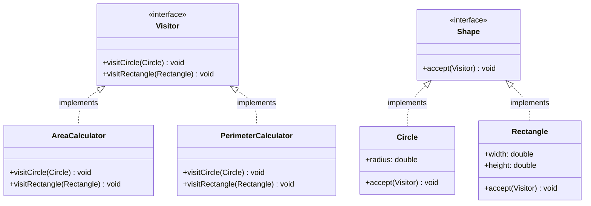

# Visitor Design Pattern

## What is Visitor Pattern?
Visitor lets you define a new operation on elements of an object structure without changing the classes of those elements.

**Key Idea:** Double dispatch. Element accepts visitor, visitor operates on element. Separates algorithms from objects they operate on.

---

## Why Use Visitor? (Problem it solves)

**Problem:**
- Need to add operations to object hierarchy
- Don't want to modify existing classes (Open/Closed Principle)
- Operations don't fit naturally in element classes
- Want to group related operations in one place

**Solution:**
- Define visitor interface with visit methods for each element type
- Elements accept visitor and call appropriate visit method
- Add new operations by creating new visitor classes
- No changes to element classes

---

## Real-World Analogy

**Tax Inspector:**
- Inspector visits different businesses (retail, restaurant, factory)
- Each business "accepts" inspector
- Inspector performs different inspection based on business type
- Adding new inspection type (health inspector) doesn't change businesses

---

## Simple Example (Shape Area/Perimeter Calculation)

### UML Diagram: Visitor Pattern Relationships



### Relationship Explanations

**1. IS-A Relationships:**
- `AreaCalculator` **IS-A** `Visitor` → implements visitor interface
- `PerimeterCalculator` **IS-A** `Visitor` → implements visitor interface
- `Circle` **IS-A** `Shape` → implements element interface
- `Rectangle` **IS-A** `Shape` → implements element interface

**2. Double Dispatch:**
```
1. Client calls: shape.accept(visitor)
2. Shape (Circle) calls: visitor.visitCircle(this)
3. Visitor executes: operation on Circle
```

**3. Key Points:**
- Visitor has visit method for each concrete element type
- Element's accept method calls appropriate visitor method (double dispatch)
- Adding operation = new visitor class (no change to elements)

- Double dispatch resolves both visitor type and element type at runtime
- Visitor centralizes related operations (all area logic in AreaCalculator)
- Open/Closed: new operations without modifying elements

```java
// Visitor interface
public interface Visitor {
    void visitCircle(Circle circle);
    void visitRectangle(Rectangle rectangle);
}

// Element interface
public interface Shape {
    void accept(Visitor visitor);
}

// Concrete Element 1: Circle
public class Circle implements Shape {
    private double radius;
    
    public Circle(double radius) {
        this.radius = radius;
    }
    
    public double getRadius() {
        return radius;
    }
    
    @Override
    public void accept(Visitor visitor) {
        visitor.visitCircle(this);  // Double dispatch: call visitor method
    }
}

// Concrete Element 2: Rectangle
public class Rectangle implements Shape {
    private double width;
    private double height;
    
    public Rectangle(double width, double height) {
        this.width = width;
        this.height = height;
    }
    
    public double getWidth() {
        return width;
    }
    
    public double getHeight() {
        return height;
    }
    
    @Override
    public void accept(Visitor visitor) {
        visitor.visitRectangle(this);  // Double dispatch
    }
}

// Concrete Visitor 1: Area Calculator
public class AreaCalculator implements Visitor {
    @Override
    public void visitCircle(Circle circle) {
        double area = Math.PI * circle.getRadius() * circle.getRadius();
        System.out.println("Circle area: " + area);
    }
    
    @Override
    public void visitRectangle(Rectangle rectangle) {
        double area = rectangle.getWidth() * rectangle.getHeight();
        System.out.println("Rectangle area: " + area);
    }
}

// Concrete Visitor 2: Perimeter Calculator
public class PerimeterCalculator implements Visitor {
    @Override
    public void visitCircle(Circle circle) {
        double perimeter = 2 * Math.PI * circle.getRadius();
        System.out.println("Circle perimeter: " + perimeter);
    }
    
    @Override
    public void visitRectangle(Rectangle rectangle) {
        double perimeter = 2 * (rectangle.getWidth() + rectangle.getHeight());
        System.out.println("Rectangle perimeter: " + perimeter);
    }
}

// Usage
public class VisitorDemo {
    public static void main(String[] args) {
        List<Shape> shapes = Arrays.asList(
            new Circle(5),
            new Rectangle(4, 6)
        );
        
        // Calculate areas
        Visitor areaCalculator = new AreaCalculator();
        System.out.println("Calculating areas:");
        for (Shape shape : shapes) {
            shape.accept(areaCalculator);
        }
        
        // Calculate perimeters (new operation, no change to shapes)
        Visitor perimeterCalculator = new PerimeterCalculator();
        System.out.println("\nCalculating perimeters:");
        for (Shape shape : shapes) {
            shape.accept(perimeterCalculator);
        }
        
        /* Output:
         * Calculating areas:
         * Circle area: 78.53981633974483
         * Rectangle area: 24.0
         * 
         * Calculating perimeters:
         * Circle perimeter: 31.41592653589793
         * Rectangle perimeter: 20.0
         */
    }
}
```

---

## E-commerce Example (Product Operations)

```java
// Visitor interface
public interface ProductVisitor {
    void visitElectronics(Electronics product);
    void visitClothing(Clothing product);
    void visitFood(Food product);
}

// Element interface
public interface Product {
    void accept(ProductVisitor visitor);
}

// Concrete Element 1: Electronics
public class Electronics implements Product {
    private String name;
    private double price;
    private int warrantyMonths;
    
    public Electronics(String name, double price, int warrantyMonths) {
        this.name = name;
        this.price = price;
        this.warrantyMonths = warrantyMonths;
    }
    
    public String getName() { return name; }
    public double getPrice() { return price; }
    public int getWarrantyMonths() { return warrantyMonths; }
    
    @Override
    public void accept(ProductVisitor visitor) {
        visitor.visitElectronics(this);
    }
}

// Concrete Element 2: Clothing
public class Clothing implements Product {
    private String name;
    private double price;
    private String size;
    
    public Clothing(String name, double price, String size) {
        this.name = name;
        this.price = price;
        this.size = size;
    }
    
    public String getName() { return name; }
    public double getPrice() { return price; }
    public String getSize() { return size; }
    
    @Override
    public void accept(ProductVisitor visitor) {
        visitor.visitClothing(this);
    }
}

// Concrete Element 3: Food
public class Food implements Product {
    private String name;
    private double price;
    private String expiryDate;
    
    public Food(String name, double price, String expiryDate) {
        this.name = name;
        this.price = price;
        this.expiryDate = expiryDate;
    }
    
    public String getName() { return name; }
    public double getPrice() { return price; }
    public String getExpiryDate() { return expiryDate; }
    
    @Override
    public void accept(ProductVisitor visitor) {
        visitor.visitFood(this);
    }
}

// Concrete Visitor 1: Tax Calculator
public class TaxCalculator implements ProductVisitor {
    @Override
    public void visitElectronics(Electronics product) {
        double tax = product.getPrice() * 0.18;  // 18% tax on electronics
        System.out.println(product.getName() + " - Tax: $" + tax);
    }
    
    @Override
    public void visitClothing(Clothing product) {
        double tax = product.getPrice() * 0.10;  // 10% tax on clothing
        System.out.println(product.getName() + " - Tax: $" + tax);
    }
    
    @Override
    public void visitFood(Food product) {
        double tax = product.getPrice() * 0.05;  // 5% tax on food
        System.out.println(product.getName() + " - Tax: $" + tax);
    }
}

// Concrete Visitor 2: Discount Calculator
public class DiscountCalculator implements ProductVisitor {
    @Override
    public void visitElectronics(Electronics product) {
        // Electronics with warranty > 12 months get 5% discount
        if (product.getWarrantyMonths() > 12) {
            double discount = product.getPrice() * 0.05;
            System.out.println(product.getName() + " - Discount: $" + discount);
        } else {
            System.out.println(product.getName() + " - No discount");
        }
    }
    
    @Override
    public void visitClothing(Clothing product) {
        // Clothing gets 10% discount
        double discount = product.getPrice() * 0.10;
        System.out.println(product.getName() + " - Discount: $" + discount);
    }
    
    @Override
    public void visitFood(Food product) {
        // Food near expiry gets 20% discount
        System.out.println(product.getName() + " - Discount: $" + (product.getPrice() * 0.20));
    }
}

// Concrete Visitor 3: Shipping Cost Calculator
public class ShippingCostCalculator implements ProductVisitor {
    @Override
    public void visitElectronics(Electronics product) {
        System.out.println(product.getName() + " - Shipping: $15 (fragile handling)");
    }
    
    @Override
    public void visitClothing(Clothing product) {
        System.out.println(product.getName() + " - Shipping: $5 (standard)");
    }
    
    @Override
    public void visitFood(Food product) {
        System.out.println(product.getName() + " - Shipping: $10 (refrigerated)");
    }
}

// Usage
public class ProductVisitorDemo {
    public static void main(String[] args) {
        List<Product> cart = Arrays.asList(
            new Electronics("Laptop", 1200, 24),
            new Clothing("T-Shirt", 30, "M"),
            new Food("Milk", 5, "2024-12-31")
        );
        
        // Calculate taxes
        ProductVisitor taxCalculator = new TaxCalculator();
        System.out.println("Tax Calculation:");
        for (Product product : cart) {
            product.accept(taxCalculator);
        }
        
        // Calculate discounts (new operation, no product changes)
        ProductVisitor discountCalculator = new DiscountCalculator();
        System.out.println("\nDiscount Calculation:");
        for (Product product : cart) {
            product.accept(discountCalculator);
        }
        
        // Calculate shipping (another operation, no product changes)
        ProductVisitor shippingCalculator = new ShippingCostCalculator();
        System.out.println("\nShipping Cost:");
        for (Product product : cart) {
            product.accept(shippingCalculator);
        }
        
        /* Output:
         * Tax Calculation:
         * Laptop - Tax: $216.0
         * T-Shirt - Tax: $3.0
         * Milk - Tax: $0.25
         * 
         * Discount Calculation:
         * Laptop - Discount: $60.0
         * T-Shirt - Discount: $3.0
         * Milk - Discount: $1.0
         * 
         * Shipping Cost:
         * Laptop - Shipping: $15 (fragile handling)
         * T-Shirt - Shipping: $5 (standard)
         * Milk - Shipping: $10 (refrigerated)
         */
    }
}
```

---

## When to Use Visitor

**Use when:**
- Need to perform operations on object structure
- Operations don't fit naturally in element classes
- Object structure rarely changes but operations change frequently
- Example: compilers (AST operations), file systems, composite structures

**Don't use when:**
- Object structure changes frequently (adding element = change all visitors)
- Operations are simple and fit naturally in element classes
- Double dispatch overhead not justified

---

End of Visitor Pattern
