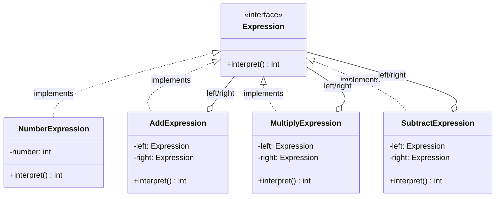

# Interpreter Design Pattern

## What is Interpreter Pattern?
Interpreter defines a representation for a grammar and an interpreter to process sentences in that language. It evaluates expressions or statements in a custom language/syntax.

**Key Idea:** Build an abstract syntax tree (AST) where each node knows how to interpret itself.

---

## Why Use Interpreter? (Problem it solves)

**Problem:**
- You have a simple language/grammar to evaluate (e.g., math expressions, search queries, config rules)
- Need to parse and execute custom syntax
- Without pattern: large switch/if-else statements parsing strings

**Solution:**
- Define grammar rules as classes (one class per grammar rule)
- Build expression tree from input
- Call `interpret()` on root node to evaluate

---

## Real-World Analogy

**Calculator:**
- Expression: "5 + 3 * 2"
- Grammar: Number, Add, Multiply
- AST: Add(Number(5), Multiply(Number(3), Number(2)))
- Evaluation: Add.interpret() → 5 + (3*2) = 11

---

## Simple Example (Boolean Expression Evaluator)

### UML Diagram: Interpreter Pattern Relationships



### Relationship Explanations

**1. IS-A Relationships:**
- `NumberExpression` **IS-A** `Expression` → leaf node (number literal)
- `AddExpression` **IS-A** `Expression` → non-terminal (+ operation)
- `MultiplyExpression` **IS-A** `Expression` → non-terminal (* operation)
- `SubtractExpression` **IS-A** `Expression` → non-terminal (- operation)

**2. HAS-A Relationships (Composite Structure):**
- `AddExpression` **HAS-A** two `Expression` → left and right operands
- `MultiplyExpression` **HAS-A** two `Expression` → left and right operands
- `SubtractExpression` **HAS-A** two `Expression` → left and right operands
- **Key:** Recursive composition builds expression tree

**3. Expression Tree (Example: 5 + 3 * 2):**
```
           ADD
          /   \
       Num(5)  MULTIPLY
               /      \
            Num(3)  Num(2)
```

- Terminal expressions are leaves (data)
- Non-terminal expressions are nodes (operations)
- Recursive `interpret()` evaluates tree bottom-up

```java
// Expression interface
public interface Expression {
    int interpret();
}

// Terminal Expression: Represents a number (leaf node)
public class NumberExpression implements Expression {
    private int number;
    
    public NumberExpression(int number) {
        this.number = number;
    }
    
    @Override
    public int interpret() {
        return number;
    }
}

// Non-terminal Expression: Addition
public class AddExpression implements Expression {
    private Expression left;
    private Expression right;
    
    public AddExpression(Expression left, Expression right) {
        this.left = left;
        this.right = right;
    }
    
    @Override
    public int interpret() {
        // Recursively interpret left + right
        return left.interpret() + right.interpret();
    }
}

// Non-terminal Expression: Multiplication
public class MultiplyExpression implements Expression {
    private Expression left;
    private Expression right;
    
    public MultiplyExpression(Expression left, Expression right) {
        this.left = left;
        this.right = right;
    }
    
    @Override
    public int interpret() {
        // Recursively interpret left * right
        return left.interpret() * right.interpret();
    }
}

// Non-terminal Expression: Subtraction
public class SubtractExpression implements Expression {
    private Expression left;
    private Expression right;
    
    public SubtractExpression(Expression left, Expression right) {
        this.left = left;
        this.right = right;
    }
    
    @Override
    public int interpret() {
        // Recursively interpret left - right
        return left.interpret() - right.interpret();
    }
}

// Usage: Build and evaluate expression tree
public class InterpreterDemo {
    public static void main(String[] args) {
        // Expression: 5 + 3 * 2 = 5 + 6 = 11
        // Tree:     ADD
        //          /   \
        //        5      MULTIPLY
        //               /      \
        //              3        2
        
        Expression multiply = new MultiplyExpression(
            new NumberExpression(3),
            new NumberExpression(2)
        );
        
        Expression add = new AddExpression(
            new NumberExpression(5),
            multiply
        );
        
        System.out.println("5 + 3 * 2 = " + add.interpret());  // 11
        
        // Expression: (10 - 4) * 2 = 6 * 2 = 12
        Expression subtract = new SubtractExpression(
            new NumberExpression(10),
            new NumberExpression(4)
        );
        
        Expression result = new MultiplyExpression(
            subtract,
            new NumberExpression(2)
        );
        
        System.out.println("(10 - 4) * 2 = " + result.interpret());  // 12
    }
}
```

**How the Code Works (Step-by-step Flow):**

1. **Build Expression Tree for: 5 + 3 * 2**
   ```
   Tree Structure:
           ADD
          /   \
       Num(5)  MULTIPLY
               /      \
            Num(3)  Num(2)
   ```

2. **Evaluation of `add.interpret()`:**
   - `AddExpression.interpret()` calls:
     - Left: `NumberExpression(5).interpret()` → returns **5**
     - Right: `MultiplyExpression.interpret()` calls:
       - Left: `NumberExpression(3).interpret()` → returns **3**
       - Right: `NumberExpression(2).interpret()` → returns **2**
       - Computes: 3 * 2 = **6**
     - Computes: 5 + 6 = **11**
   - **Result:** 11

3. **Build Expression Tree for: (10 - 4) * 2**
   ```
   Tree Structure:
         MULTIPLY
        /        \
    SUBTRACT    Num(2)
    /      \
  Num(10) Num(4)
   ```

4. **Evaluation of `result.interpret()`:**
   - `MultiplyExpression.interpret()` calls:
     - Left: `SubtractExpression.interpret()` calls:
       - Left: `NumberExpression(10).interpret()` → returns **10**
       - Right: `NumberExpression(4).interpret()` → returns **4**
       - Computes: 10 - 4 = **6**
     - Right: `NumberExpression(2).interpret()` → returns **2**
     - Computes: 6 * 2 = **12**
   - **Result:** 12

**Key Insight:** 
- Evaluation uses **post-order traversal** (left child → right child → parent)
- Each node evaluates its children before computing its own result
- Recursive structure enables complex nested expressions


---

## E-commerce Example (Discount Rule Evaluator)

```java
// Context: holds order data
public class OrderContext {
    private double totalAmount;
    private String customerType;
    private int itemCount;
    
    public OrderContext(double totalAmount, String customerType, int itemCount) {
        this.totalAmount = totalAmount;
        this.customerType = customerType;
        this.itemCount = itemCount;
    }
    
    // Getters
    public double getTotalAmount() { return totalAmount; }
    public String getCustomerType() { return customerType; }
    public int getItemCount() { return itemCount; }
}

// Expression interface
public interface DiscountRule {
    boolean evaluate(OrderContext context);
}

// Terminal: Check if total amount > threshold
public class AmountRule implements DiscountRule {
    private double threshold;
    
    public AmountRule(double threshold) {
        this.threshold = threshold;
    }
    
    @Override
    public boolean evaluate(OrderContext context) {
        return context.getTotalAmount() > threshold;
    }
}

// Terminal: Check if customer is VIP
public class VIPCustomerRule implements DiscountRule {
    @Override
    public boolean evaluate(OrderContext context) {
        return "VIP".equals(context.getCustomerType());
    }
}

// Terminal: Check if item count > threshold
public class BulkOrderRule implements DiscountRule {
    private int minItems;
    
    public BulkOrderRule(int minItems) {
        this.minItems = minItems;
    }
    
    @Override
    public boolean evaluate(OrderContext context) {
        return context.getItemCount() >= minItems;
    }
}

// Non-terminal: AND logic
public class AndRule implements DiscountRule {
    private DiscountRule rule1;
    private DiscountRule rule2;
    
    public AndRule(DiscountRule rule1, DiscountRule rule2) {
        this.rule1 = rule1;
        this.rule2 = rule2;
    }
    
    @Override
    public boolean evaluate(OrderContext context) {
        return rule1.evaluate(context) && rule2.evaluate(context);
    }
}

// Non-terminal: OR logic
public class OrRule implements DiscountRule {
    private DiscountRule rule1;
    private DiscountRule rule2;
    
    public OrRule(DiscountRule rule1, DiscountRule rule2) {
        this.rule1 = rule1;
        this.rule2 = rule2;
    }
    
    @Override
    public boolean evaluate(OrderContext context) {
        return rule1.evaluate(context) || rule2.evaluate(context);
    }
}

// Usage: Build complex discount rules
public class DiscountEvaluatorDemo {
    public static void main(String[] args) {
        // Rule: (VIP customer) OR (amount > 500 AND items >= 5)
        DiscountRule vipRule = new VIPCustomerRule();
        DiscountRule amountRule = new AmountRule(500);
        DiscountRule bulkRule = new BulkOrderRule(5);
        
        DiscountRule bulkDiscount = new AndRule(amountRule, bulkRule);
        DiscountRule finalRule = new OrRule(vipRule, bulkDiscount);
        
        // Test orders
        OrderContext order1 = new OrderContext(600, "REGULAR", 6);
        OrderContext order2 = new OrderContext(300, "VIP", 2);
        OrderContext order3 = new OrderContext(200, "REGULAR", 2);
        
        System.out.println("Order1 eligible? " + finalRule.evaluate(order1));  // true (amount > 500 AND items >= 5)
        System.out.println("Order2 eligible? " + finalRule.evaluate(order2));  // true (VIP)
        System.out.println("Order3 eligible? " + finalRule.evaluate(order3));  // false
    }
}
```

**How the Code Works (Step-by-step Flow):**

1. **Build Rule Tree: (VIP) OR (amount > 500 AND items >= 5)**
   ```
   Tree Structure:
           OR
          /  \
        VIP   AND
             /   \
       Amount>500 Items>=5
   ```

2. **Test Order1: `{amount: 600, type: REGULAR, items: 6}`**
   - `OrRule.evaluate(order1)`:
     - Left: `VIPCustomerRule.evaluate()` → checks "REGULAR" == "VIP" → **false**
     - Right: `AndRule.evaluate()`:
       - Left: `AmountRule(500).evaluate()` → 600 > 500 → **true**
       - Right: `BulkOrderRule(5).evaluate()` → 6 >= 5 → **true**
       - AND result: true && true → **true**
     - OR result: false || true → **true** ✅
   - **Result:** Order1 eligible

3. **Test Order2: `{amount: 300, type: VIP, items: 2}`**
   - `OrRule.evaluate(order2)`:
     - Left: `VIPCustomerRule.evaluate()` → checks "VIP" == "VIP" → **true**
     - Short-circuit: OR doesn't evaluate right side (already true)
     - OR result: **true** ✅
   - **Result:** Order2 eligible (VIP bypass)

4. **Test Order3: `{amount: 200, type: REGULAR, items: 2}`**
   - `OrRule.evaluate(order3)`:
     - Left: `VIPCustomerRule.evaluate()` → checks "REGULAR" == "VIP" → **false**
     - Right: `AndRule.evaluate()`:
       - Left: `AmountRule(500).evaluate()` → 200 > 500 → **false**
       - Short-circuit: AND doesn't evaluate right side (already false)
       - AND result: **false**
     - OR result: false || false → **false** ❌
   - **Result:** Order3 NOT eligible

**Key Insight:** 
- Complex business rules built compositionally from simple terminal expressions
- Short-circuit evaluation (OR stops at first true, AND stops at first false)
- Easy to add new rules: just create new DiscountRule implementations


---

## When to Use Interpreter

**Use when:**
- Have a simple grammar to parse and evaluate
- Grammar is stable (doesn't change frequently)
- Performance is not critical (tree traversal can be slow)
- Example: config files, search queries, simple scripting languages, rule engines

**Don't use when:**
- Grammar is complex (use parser generators like ANTLR instead)
- Performance is critical (interpreter pattern is slower than compiled code)
- Grammar changes frequently (many classes to update)

---

End of Interpreter Pattern
