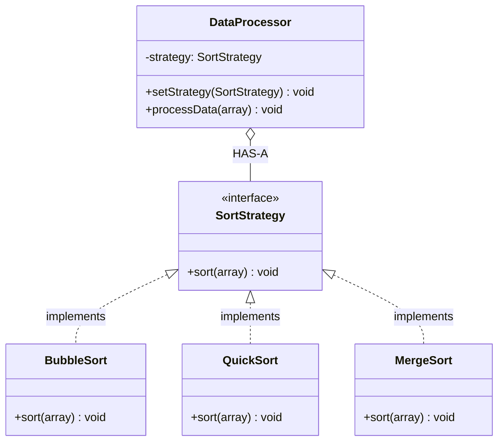

# Strategy Design Pattern

## What is Strategy Pattern?
Strategy defines a family of algorithms, encapsulates each one, and makes them interchangeable. Strategy lets the algorithm vary independently from clients that use it.

**Key Idea:** Extract algorithm into separate strategy classes. Client can switch strategies at runtime.

---

## Why Use Strategy? (Problem it solves)

**Problem:**
- Multiple algorithms for same task (e.g., different sorting algorithms)
- Large conditional statements selecting algorithm
- Algorithm varies independently of client
- Need to switch algorithm at runtime

**Solution:**
- Define strategy interface for algorithm
- Implement concrete strategies
- Context holds strategy reference and delegates execution
- Client can change strategy at runtime

---

## Real-World Analogy

**Navigation App:**
- Same destination, different routes:
  - Car route (fastest)
  - Bike route (bike lanes)
  - Walk route (pedestrian paths)
- User switches route strategy based on transportation mode
- App doesn't change; just uses different strategy

---

## Simple Example (Sorting Strategies)

### UML Diagram: Strategy Pattern Relationships



### Relationship Explanations

**1. IS-A Relationships:**
- `BubbleSort` **IS-A** `SortStrategy` → implements strategy interface
- `QuickSort` **IS-A** `SortStrategy` → implements strategy interface
- `MergeSort` **IS-A** `SortStrategy` → implements strategy interface

**2. HAS-A Relationship:**
- `DataProcessor` **HAS-A** `SortStrategy` → context holds strategy reference
- **Key:** Context delegates algorithm execution to strategy

**3. Strategy Switching Flow:**
```
1. DataProcessor.setStrategy(new QuickSort()) → sets strategy
2. DataProcessor.processData(array) → delegates to strategy.sort(array)
3. Client can change: processor.setStrategy(new MergeSort())
```

- Context doesn't know concrete strategy classes (loose coupling)
- Strategies interchangeable at runtime (no code change in context)
- Each strategy encapsulates algorithm (Open/Closed Principle)

```java
// Strategy interface
public interface SortStrategy {
    void sort(int[] array);
}

// Concrete Strategy 1: Bubble Sort
public class BubbleSort implements SortStrategy {
    @Override
    public void sort(int[] array) {
        System.out.println("Sorting using Bubble Sort");
        // Simplified bubble sort
        for (int i = 0; i < array.length - 1; i++) {
            for (int j = 0; j < array.length - i - 1; j++) {
                if (array[j] > array[j + 1]) {
                    int temp = array[j];
                    array[j] = array[j + 1];
                    array[j + 1] = temp;
                }
            }
        }
    }
}

// Concrete Strategy 2: Quick Sort
public class QuickSort implements SortStrategy {
    @Override
    public void sort(int[] array) {
        System.out.println("Sorting using Quick Sort");
        quickSort(array, 0, array.length - 1);
    }
    
    private void quickSort(int[] array, int low, int high) {
        if (low < high) {
            int pi = partition(array, low, high);
            quickSort(array, low, pi - 1);
            quickSort(array, pi + 1, high);
        }
    }
    
    private int partition(int[] array, int low, int high) {
        int pivot = array[high];
        int i = low - 1;
        for (int j = low; j < high; j++) {
            if (array[j] < pivot) {
                i++;
                int temp = array[i];
                array[i] = array[j];
                array[j] = temp;
            }
        }
        int temp = array[i + 1];
        array[i + 1] = array[high];
        array[high] = temp;
        return i + 1;
    }
}

// MergeSortStrategy

// Context: Data Processor
public class DataProcessor {
    private SortStrategy strategy;
    
    public void setStrategy(SortStrategy strategy) {
        this.strategy = strategy;
    }
    
    public void processData(int[] array) {
        strategy.sort(array);
        System.out.println("Sorted: " + Arrays.toString(array));
    }
}

// Usage
public class StrategyDemo {
    public static void main(String[] args) {
        DataProcessor processor = new DataProcessor();
        int[] data = {5, 2, 8, 1, 9};
        
        // Use Bubble Sort
        processor.setStrategy(new BubbleSort());
        processor.processData(data.clone());
        
        // Switch to Quick Sort
        processor.setStrategy(new QuickSort());
        processor.processData(new int[]{5, 2, 8, 1, 9});

        // Switch to Selection Sort
        processor.setStrategy(new SelectionSort());
        processor.processData(new int[]{5, 2, 8, 1, 9});

        processor.setStrategy(new MergeSortStrategy());
        processor.processData(new int[]{5, 2, 8, 1, 9});
        
        /* Output:
         * Sorting using Bubble Sort
         * Sorted: [1, 2, 5, 8, 9]
         * Sorting using Quick Sort
         * Sorted: [1, 2, 5, 8, 9]
         */
    }
}
```

---

## E-commerce Example (Payment Strategies)

```java
// Strategy interface
public interface PaymentStrategy {
    void pay(double amount);
}

// Concrete Strategy 1: Credit Card
public class CreditCardPayment implements PaymentStrategy {
    private String cardNumber;
    private String cvv;
    
    public CreditCardPayment(String cardNumber, String cvv) {
        this.cardNumber = cardNumber;
        this.cvv = cvv;
    }
    
    @Override
    public void pay(double amount) {
        System.out.println("Paid $" + amount + " using Credit Card ****" + 
                          cardNumber.substring(cardNumber.length() - 4));
        // Payment gateway integration logic
    }
}

// Concrete Strategy 2: PayPal
public class PayPalPayment implements PaymentStrategy {
    private String email;
    
    public PayPalPayment(String email) {
        this.email = email;
    }
    
    @Override
    public void pay(double amount) {
        System.out.println("Paid $" + amount + " using PayPal: " + email);
        // PayPal API integration logic
    }
}

// Concrete Strategy 3: Cryptocurrency
public class CryptoPayment implements PaymentStrategy {
    private String walletAddress;
    
    public CryptoPayment(String walletAddress) {
        this.walletAddress = walletAddress;
    }
    
    @Override
    public void pay(double amount) {
        System.out.println("Paid $" + amount + " using Crypto wallet: " + walletAddress);
        // Blockchain transaction logic
    }
}

// Context: Shopping Cart
public class ShoppingCart {
    private List<String> items = new ArrayList<>();
    private double total;
    private PaymentStrategy paymentStrategy;
    
    public void addItem(String item, double price) {
        items.add(item);
        total += price;
    }
    
    public void setPaymentStrategy(PaymentStrategy paymentStrategy) {
        this.paymentStrategy = paymentStrategy;
    }
    
    public void checkout() {
        if (paymentStrategy == null) {
            System.out.println("Please select a payment method");
            return;
        }
        
        System.out.println("Items: " + items);
        System.out.println("Total: $" + total);
        paymentStrategy.pay(total);
    }
}

// Usage
public class PaymentStrategyDemo {
    public static void main(String[] args) {
        ShoppingCart cart = new ShoppingCart();
        cart.addItem("Laptop", 1200.0);
        cart.addItem("Mouse", 25.0);
        
        // Customer chooses payment method at runtime
        System.out.println("Payment Option 1: Credit Card");
        cart.setPaymentStrategy(new CreditCardPayment("1234567890123456", "123"));
        cart.checkout();
        
        System.out.println("\nPayment Option 2: PayPal");
        cart.setPaymentStrategy(new PayPalPayment("user@example.com"));
        cart.checkout();
        
        System.out.println("\nPayment Option 3: Cryptocurrency");
        cart.setPaymentStrategy(new CryptoPayment("0x1234567890abcdef"));
        cart.checkout();

        cart.setPaymentStrategy(new ErupeePayment("0x1234567890abcdef"));
        cart.checkout();


        
        /* Output:
         * Payment Option 1: Credit Card
         * Items: [Laptop, Mouse]
         * Total: $1225.0
         * Paid $1225.0 using Credit Card ****3456
         * 
         * Payment Option 2: PayPal
         * Items: [Laptop, Mouse]
         * Total: $1225.0
         * Paid $1225.0 using PayPal: user@example.com
         * 
         * Payment Option 3: Cryptocurrency
         * Items: [Laptop, Mouse]
         * Total: $1225.0
         * Paid $1225.0 using Crypto wallet: 0x1234567890abcdef
         */
    }
}
```

---

## When to Use Strategy

**Use when:**
- Multiple algorithms for same task
- Need to switch algorithm at runtime
- Want to isolate algorithm from client code
- Example: payment methods, compression, routing, validation rules

**Don't use when:**
- Only one algorithm exists
- Algorithm never changes
- Overhead of extra classes not justified

---

End of Strategy Pattern
