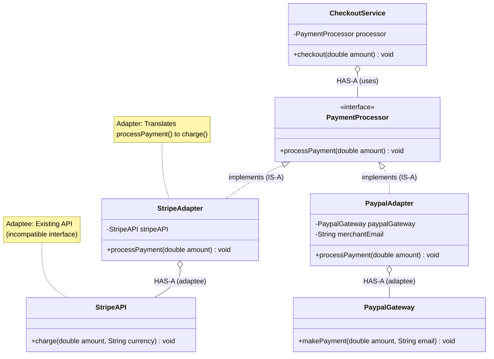

# Adapter Design Pattern

Adaptor 

Adroid - 3.5mm audio jack - Wired headphone

Iphone - Do not have 3.5mm jack, 
         Type C                   - Type C to 3.5mm Converter - Wired hardphones. 
                                            ADAPTER

## What is Adapter Pattern?
Adapter (also called Wrapper) converts the interface of a class into another interface that clients expect. It lets classes work together that couldn't otherwise because of incompatible interfaces.

**Key Idea:** Wrap an existing class with a new interface so it can be used by code expecting a different interface.

---

## Why Use Adapter? (Problem it solves)

**Problem:**
- You have an existing class with a useful implementation
- But its interface doesn't match what your code expects
- You can't (or don't want to) modify the existing class

**Solution:**
- Create an Adapter class that implements the expected interface
- The Adapter delegates calls to the existing class (adaptee)
- Client uses the Adapter without knowing about the adaptee

---

## Real-World Analogy

**Power Plug Adapter:**
- You have a US laptop (2-prong plug)
- You're in Europe (need 2-round-pin plug)
- You can't change the laptop plug
- **Solution:** Use a plug adapter — it has US socket on one side, European plug on other side
- The adapter "translates" between incompatible interfaces

---

## Simple Example (Payment Gateway Adapter)

### UML Diagram: Adapter Pattern Relationships




### Relationship Explanations

**1. IS-A Relationships (Implementation):**
- `StripeAdapter` **IS-A** `PaymentProcessor` → implements the target interface
- `PaypalAdapter` **IS-A** `PaymentProcessor` → implements the target interface
- **Purpose:** Both adapters present the same interface to client (uniform API)
- **Benefit:** Client code (`CheckoutService`) works with any payment adapter
- **Arrow:** Dotted line with hollow triangle (implements)

**2. HAS-A Relationships (Composition/Aggregation):**
- `StripeAdapter` **HAS-A** `StripeAPI` → adapter holds reference to adaptee
- `PaypalAdapter` **HAS-A** `PaypalGateway` → adapter holds reference to adaptee
- `CheckoutService` **HAS-A** `PaymentProcessor` → client depends on target interface
- **Purpose:** Adapter wraps adaptee to translate interface

**3. Adapter Role (Translation Layer):**
```
Client Request:
  CheckoutService → processPayment(100.0)

Adapter Translation:
  StripeAdapter receives: processPayment(100.0)
  StripeAdapter translates to: stripeAPI.charge(100.0, "USD")
  
  PaypalAdapter receives: processPayment(100.0)
  PaypalAdapter translates to: paypalGateway.makePayment(100.0, merchantEmail)

  VisaAdapter receives: processPayment(100.0)
  VisaAdapter translates to: VisaGateway.makePayment(100.0 + 2.5%)

  AmexAdapter receives: processPayment(100.0)
  AmexAdapter translates to: AmexGateway.makePayment(100.0 + 3%)
```

**4. Key Pattern Elements:**
- **Target (interface):** `PaymentProcessor` — interface client expects
- **Adapter:** `StripeAdapter`, `PaypalAdapter` — implements Target, holds Adaptee
- **Adaptee:** `StripeAPI`, `PaypalGateway` — existing class with incompatible interface
- **Client:** `CheckoutService` — uses Target interface, unaware of adapters/adaptees

**5. Why Composition (HAS-A) Not Inheritance:**
```
BAD: class StripeAdapter extends StripeAPI implements PaymentProcessor
Problem: If StripeAPI has many methods, StripeAdapter inherits all (tight coupling)

GOOD: class StripeAdapter implements PaymentProcessor { private StripeAPI api; }
Benefit: Adapter only exposes PaymentProcessor interface, hides StripeAPI details
```

**6. Delegation Flow:**
```
1. Client calls: processor.processPayment(100)
2. Adapter receives call (implements PaymentProcessor interface)
3. Adapter translates parameters:
   - May add extra params (currency, email)
   - May convert data types (double → int)
   - May format data (dollars → cents)
4. Adapter delegates to adaptee: stripeAPI.charge(100, "USD")
5. Adaptee performs actual work
6. Adapter may translate result back to client (if needed)
```

**8. Real-World Benefit:**
- **Switch payment providers:** Change `new StripeAdapter()` to `new PaypalAdapter()`
- **Client code unchanged:** `CheckoutService` doesn't care which adapter is used
- **Add new providers:** Create `SquareAdapter` without modifying existing code
- **Isolate changes:** If Stripe API changes, only `StripeAdapter` needs update


```java
// Target interface: what client expects
public interface PaymentProcessor {
    /*
     * Client code expects this interface.
     * All payment adapters must implement this.
     */
    void processPayment(double amount);
}

// Adaptee 1: Existing Stripe API (incompatible interface)
public class StripeAPI {
    /*
     * This is an existing third-party library with its own interface.
     * We cannot change this class (it's external).
     * Method signature doesn't match PaymentProcessor.
     */
    public void charge(double amount, String currency) {
        System.out.println("Stripe: Charging $" + amount + " " + currency);
        // Real implementation would call Stripe's REST API
    }
}

// Adapter: Adapts StripeAPI to PaymentProcessor interface
public class StripeAdapter implements PaymentProcessor {
    private StripeAPI stripeAPI;  // Adaptee (the class being adapted)
    
    public StripeAdapter(StripeAPI stripeAPI) {
        this.stripeAPI = stripeAPI;
    }
    
    @Override
    public void processPayment(double amount) {
        /*
         * Adapter's job: translate client's call to adaptee's interface.
         * Client calls: processPayment(100)
         * Adapter calls: stripeAPI.charge(100, "USD")
         */
        stripeAPI.charge(amount, "USD");  // Assume USD for simplicity
    }
}

// Adaptee 2: Existing Paypal API (different incompatible interface)
public class PaypalGateway {
    /*
     * Another third-party library with yet another interface.
     * Method name and signature are different from both
     * PaymentProcessor and StripeAPI.
     */
    public void makePayment(double amount, String email) {
        System.out.println("Paypal: Payment of $" + amount + " to " + email);
        // Real implementation would call Paypal's SDK
    }
}

// Adapter: Adapts PaypalGateway to PaymentProcessor interface
public class PaypalAdapter implements PaymentProcessor {
    private PaypalGateway paypalGateway;
    private String merchantEmail;  // Extra config needed for Paypal
    
    public PaypalAdapter(PaypalGateway paypalGateway, String merchantEmail) {
        this.paypalGateway = paypalGateway;
        this.merchantEmail = merchantEmail;
    }
    
    @Override
    public void processPayment(double amount) {
        /*
         * Translate processPayment() to makePayment().
         * Adapter provides the extra merchantEmail parameter.
         */
        paypalGateway.makePayment(amount, merchantEmail);
    }
}

// Client: Works with PaymentProcessor interface (doesn't know about adaptees)
public class CheckoutService {
    private PaymentProcessor paymentProcessor;
    
    public CheckoutService(PaymentProcessor processor) {
        this.paymentProcessor = processor;
    }
    
    public void checkout(double amount) {
        /*
         * Client only knows about PaymentProcessor interface.
         * It doesn't know (or care) if it's Stripe, Paypal, or something else.
         * This is loose coupling via adapter.
         */
        System.out.println("Processing checkout for $" + amount);
        paymentProcessor.processPayment(amount);
    }
}

// Usage: Swap payment gateways easily
public class AdapterDemo {
    public static void main(String[] args) {
        // Scenario 1: Use Stripe
        StripeAPI stripe = new StripeAPI();
        PaymentProcessor stripeAdapter = new StripeAdapter(stripe);
        CheckoutService checkout1 = new CheckoutService(stripeAdapter);
        checkout1.checkout(100.0);
        // Output: Stripe: Charging $100.0 USD
        
        System.out.println();
        
        // Scenario 2: Switch to Paypal (no changes to CheckoutService!)
        PaypalGateway paypal = new PaypalGateway();
        PaymentProcessor paypalAdapter = new PaypalAdapter(paypal, "merchant@example.com");
        CheckoutService checkout2 = new CheckoutService(paypalAdapter);
        checkout2.checkout(200.0);
        // Output: Paypal: Payment of $200.0 to merchant@example.com
    }
}
```