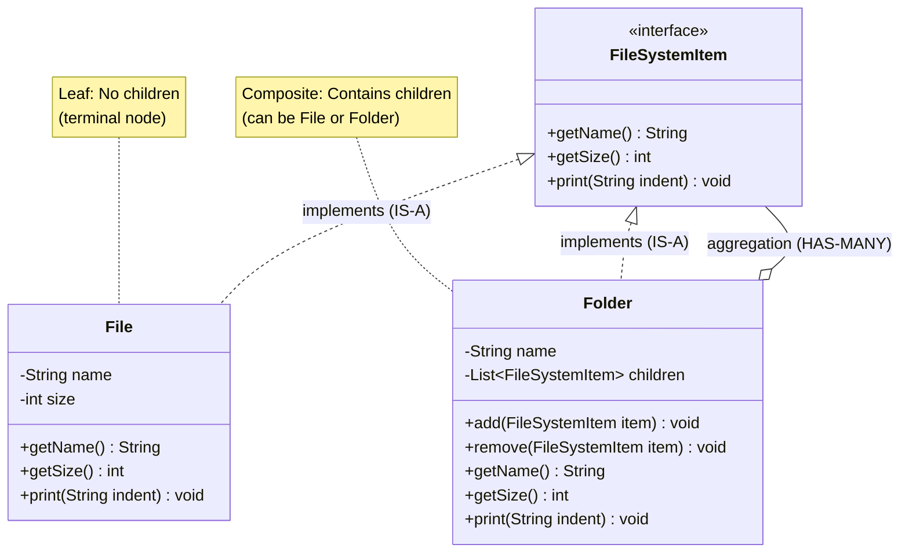

# Composite Design Pattern

Composite - Made of different parts to act as whole.

## What is Composite Pattern?
Composite lets you compose objects into tree structures to represent part-whole hierarchies. It allows clients to treat **individual objects** and **compositions of objects** uniformly.

**Key Idea:** Use the same interface for single objects (leaf) and groups of objects (composite).

---

## Why Use Composite? (Problem it solves)

**Problem:**
- You have objects that form a tree/hierarchy (folders contain files, organizations have departments)
- You want to treat single objects and groups the same way
- Without Composite: clients need different code for leaves vs composites

**Solution:**
- Define a common interface for both leaf and composite
- Composites contain children (can be leaf or composite)
- Client code works with the interface, doesn't care about leaf vs composite

---

## Real-World Analogy

**File System:**
- **File** (leaf) = individual item, no children
- **Folder** (composite) = contains files and other folders
- Both implement `FileSystemItem` interface with `getSize()`, `print()` methods
- User doesn't care if clicking a File or Folder — both respond to same operations

---

## Simple Example (File System)

### UML Diagram: Composite Pattern Relationships




Notes:
- File, Folder IS-A FileSystemItem (uniform interface)
- Folder HAS-MANY FileSystemItem (children can be File or Folder)
- Enables recursive trees (Folder contains Folder contains File)


### Relationship Explanations

**1. IS-A Relationships (Inheritance/Implementation):**
- `File` **IS-A** `FileSystemItem` → File implements FileSystemItem interface
- `Folder` **IS-A** `FileSystemItem` → Folder implements FileSystemItem interface
- **Benefit:** Client can treat File and Folder uniformly through FileSystemItem interface

**2. HAS-A Relationships (Composition/Aggregation):**
- `Folder` **HAS-MANY** `FileSystemItem` → Folder contains a list of children
- **Key:** Children can be File (leaf) OR Folder (composite) — this enables recursive tree structure
- **Aggregation:** Hollow diamond (children can exist independently)
- **Lifecycle:** If Folder is deleted, children may still exist elsewhere in memory

**3. Recursive Structure:**
- Folder contains FileSystemItem (interface)
- FileSystemItem can be File OR Folder
- Therefore: Folder can contain other Folders (nested folders)
- This creates tree/hierarchy: root → folders → subfolders → files

**4. Key Pattern Elements:**
- **Component (interface):** `FileSystemItem` — defines common operations
- **Leaf:** `File` — no children, implements Component
- **Composite:** `Folder` — has children, implements Component, delegates to children
- **Client:** Works with Component interface, doesn't know if it's Leaf or Composite

**5. Method Delegation Flow:**
```
Client calls: root.getSize()
  → Folder.getSize() is called
  → Folder iterates children: child1.getSize() + child2.getSize() + ...
  → If child is File: returns file size (base case)
  → If child is Folder: recursively sums its children (recursive case)
  → Result bubbles up: total size of entire tree
```

**6. Example Tree Structure:**
```
root (Folder) ──HAS-MANY──┐
├── file1.txt (File, 100 bytes)
├── file2.txt (File, 200 bytes)
└── documents (Folder) ──HAS-MANY──┐
    ├── resume.pdf (File, 500 bytes)
    └── photos (Folder) ──HAS-MANY──┐
        └── pic.jpg (File, 1000 bytes)
```


- **Polymorphism:** `root.print()` works whether root is File or Folder
- **Uniform treatment:** Same operations (getName, getSize) on all nodes
- **Recursive composition:** Folder contains Folder contains Folder... (tree depth unlimited)
- **Type safety:** `List<FileSystemItem>` accepts both File and Folder

```java
// Component interface: common operations for leaf and composite
public interface FileSystemItem {
    /*
     * getName(), getSize(), print() work for BOTH files and folders.
     * This is the key to Composite pattern: uniform interface.
     */
    String getName();
    int getSize();      // File returns its size, Folder returns sum of children
    void print(String indent);  // Pretty-print the hierarchy
}

// Leaf: represents individual file (no children)
public class File implements FileSystemItem {
    private String name;
    private int size;  // in bytes
    
    public File(String name, int size) {
        this.name = name;
        this.size = size;
    }
    
    @Override
    public String getName() { return name; }
    
    @Override
    public int getSize() { return size; }  // Leaf returns its own size
    
    @Override
    public void print(String indent) {
        System.out.println(indent + "File: " + name + " (" + size + " bytes)");
    }
}

// Composite: represents folder (can contain files and other folders)
public class Folder implements FileSystemItem {
    private String name;
    /*
     * KEY: Composite holds a collection of FileSystemItem (can be File or Folder).
     * This allows recursive tree structure: folders contain folders contain files.
     */
    private List<FileSystemItem> children = new ArrayList<>();
    
    public Folder(String name) {
        this.name = name;
    }
    
    // Add child (can be File or Folder — we don't care, both are FileSystemItem)
    public void add(FileSystemItem item) {
        children.add(item);
    }
    
    public void remove(FileSystemItem item) {
        children.remove(item);
    }
    
    @Override
    public String getName() { return name; }
    
    @Override
    public int getSize() {
        
        int totalSize = 0;
        for (FileSystemItem item : children) {
            totalSize += item.getSize();  // Polymorphic call
        }
        return totalSize;
    }
    
    @Override
    public void print(String indent) {
        System.out.println(indent + "Folder: " + name + " (" + getSize() + " bytes total)");
        // Recursively print all children
        for (FileSystemItem item : children) {
            item.print(indent + "  ");  // Increase indent for children
        }
    }
}

// Usage: Client treats File and Folder uniformly
public class FileSystemDemo {
    public static void main(String[] args) {
        // Create files (leaves)
        File file1 = new File("file1.txt", 100);
        File file2 = new File("file2.txt", 200);
        File resume = new File("resume.pdf", 500);
        File photo = new File("pic.jpg", 1000);
        
        // Create folders (composites)
        Folder root = new Folder("root");
        Folder documents = new Folder("documents");
        Folder photos = new Folder("photos");
        
        // Build tree structure
        root.add(file1);
        root.add(file2);
        root.add(documents);
        
        documents.add(resume);
        documents.add(photos);
        
        photos.add(photo);
        
        // Client code: treat root as FileSystemItem (don't care if leaf or composite)
        System.out.println("Total size: " + root.getSize() + " bytes");
        root.print("");
        
        /* Output:
         * Total size: 1800 bytes
         * Folder: root (1800 bytes total)
         *   File: file1.txt (100 bytes)
         *   File: file2.txt (200 bytes)
         *   Folder: documents (1500 bytes total)
         *     File: resume.pdf (500 bytes)
         *     Folder: photos (1000 bytes total)
         *       File: pic.jpg (1000 bytes)
         */
    }
}
```