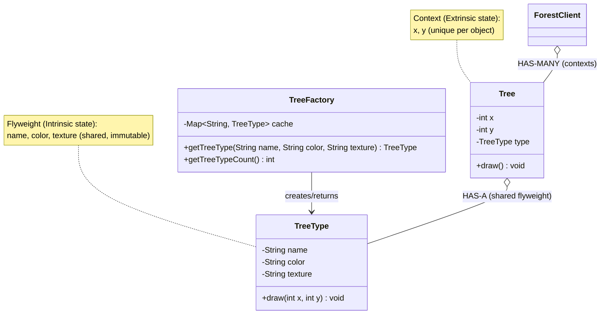

# Flyweight Design Pattern

## What is Flyweight Pattern?
Flyweight minimizes memory usage by sharing common state among many similar objects. It separates intrinsic state (shared) from extrinsic state (unique).

**Key Idea:** Share immutable objects to save memory when creating many similar objects.

---

## Real-World Analogy
**Character Rendering in Text Editor:**
- Don't create separate object for each 'a' character (millions in a document)
- Share one 'a' glyph object (font, shape) among all instances
- Each instance stores only unique data (position, color)


Make a forest for a video game.

Tree - 10cm, 12cm,20cm
Color - Red, Green, Dark Green

Create 100 tress, I will create 100 object
100 object will take memory.

10cm, Red - 30.    - One Object for this configuration
12cm, Green - 30.  - One object for this config
20cm, BLue  - 40.  - One Object for this config.

Just reuse the above 3 objects to create 100 trees.


---

## Key Concepts

**Intrinsic State:** Shared, immutable data (stored in Flyweight)
**Extrinsic State:** Unique, context-specific data (passed to methods)

---

## Simple Example (Tree Forest - Game Development)

### UML Diagram: Flyweight Pattern Relationships



### Relationship Explanations

- Intrinsic (shared) vs Extrinsic (unique): `TreeType` holds shared data; `Tree` holds per-instance state (position) and passes it into flyweight methods.
- HAS-A (composition/aggregation): Each `Tree` HAS-A reference to a shared `TreeType` instance; thousands of Trees can reference a handful of TreeTypes.
- Factory role: `TreeFactory` manages a cache (pool) of `TreeType` objects and returns existing instances to ensure sharing.
- Immutability: Intrinsic state must be immutable or treated as read-only to be safely shared.

IMP:
```
Without Flyweight: N Trees × Large Intrinsic = Huge memory
With Flyweight: N Trees (small) + K TreeTypes (large, shared) where K ≪ N
```

```java
// Flyweight: Shared tree type (intrinsic state)
public class TreeType {
    private String name;
    private String color;
    private String texture;  // Imagine this is a large image
    
    public TreeType(String name, String color, String texture) {
        this.name = name;
        this.color = color;
        this.texture = texture;
        System.out.println("Creating TreeType: " + name + " (intrinsic state)");
    }
    
    public void draw(int x, int y) {  // Extrinsic state passed as parameters
        System.out.println("Drawing " + name + " tree at (" + x + ", " + y + ")");
    }
}

// Flyweight Factory: Manages shared flyweights
public class TreeFactory {
    private static Map<String, TreeType> treeTypes = new HashMap<>();
    
    public static TreeType getTreeType(String name, String color, String texture) {
        String key = name + "-" + color;
        
        if (!treeTypes.containsKey(key)) {
            treeTypes.put(key, new TreeType(name, color, texture));
        }
        
        return treeTypes.get(key);  // Return shared instance
    }
    
    public static int getTreeTypeCount() {
        return treeTypes.size();
    }
}

// Context: Stores extrinsic state (unique per tree)
public class Tree {
    private int x, y;  // Unique position for this tree
    private TreeType type;  // Shared flyweight
    
    public Tree(int x, int y, TreeType type) {
        this.x = x;
        this.y = y;
        this.type = type;
    }
    
    public void draw() {
        type.draw(x, y);  // Pass extrinsic state to flyweight
    }
}

// Usage: Create a forest with many trees
public class FlyweightDemo {
    public static void main(String[] args) {
        // Create 1 million oak trees (only 1 TreeType object created!)
        List<Tree> forest = new ArrayList<>();
        
        TreeType oakType = TreeFactory.getTreeType("Oak", "Green", "oak_texture.png");
        TreeType pineType = TreeFactory.getTreeType("Pine", "Dark Green", "pine_texture.png");
        
        // Plant 500,000 oak trees
        for (int i = 0; i < 500000; i++) {
            forest.add(new Tree(random(), random(), oakType));  // Share oakType
        }
        
        // Plant 500,000 pine trees
        for (int i = 0; i < 500000; i++) {
            forest.add(new Tree(random(), random(), pineType));  // Share pineType
        }
        
        System.out.println("Total trees: " + forest.size());
        System.out.println("Unique TreeType objects: " + TreeFactory.getTreeTypeCount());
        
        // Draw first few trees
        forest.get(0).draw();
        forest.get(1).draw();
        
        /* Output:
         * Creating TreeType: Oak (intrinsic state)
         * Creating TreeType: Pine (intrinsic state)
         * Total trees: 1000000
         * Unique TreeType objects: 2
         * Drawing Oak tree at (42, 17)
         * Drawing Oak tree at (93, 56)
         * 
         * Memory saved: 1M trees but only 2 TreeType objects!
         * 
         * 1M Tree Objects refering same 2 Tree types
         * W/o 1M Tree will have 5lac Ooak Types and 5Lac Pine types = 20lac or 2m
         */

    }
    
    private static int random() { return (int)(Math.random() * 100); }
}
```