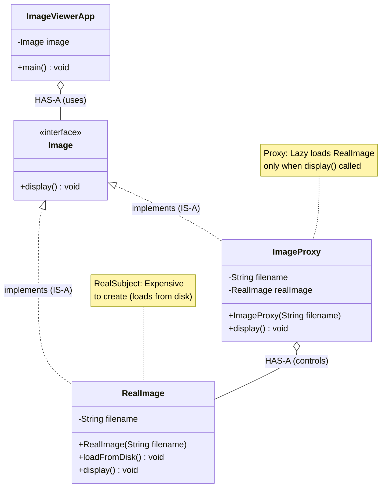
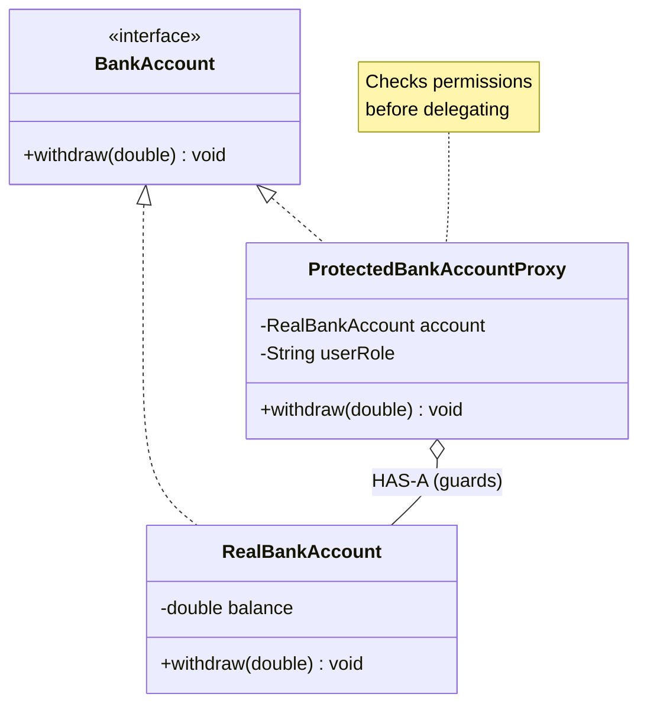

# Proxy Design Pattern

## What is Proxy Pattern?
Proxy provides a substitute or placeholder for another object to control access to it. The proxy has the same interface as the real object and forwards requests to it, adding extra functionality before or after.

**Key Idea:** Create a surrogate object that controls access to the real object.

---

## Why Use Proxy? (Problem it solves)

**Problem:**
- Creating an object is expensive (heavyweight resource)
- Need to control access (security, permissions)
- Want to add behavior (logging, caching) without modifying real object
- Object might be remote or not yet created

**Solution:**
- Create a Proxy with the same interface as RealSubject
- Proxy controls when/how RealSubject is accessed
- Client uses Proxy, unaware of the real object behind it

---

## Real-World Analogy

**Credit Card (Proxy for Bank Account):**
- You don't carry cash (real money) everywhere
- Credit card is a proxy to your bank account
- Card adds: security (PIN), tracking (statements), control (credit limit)
- When you swipe, proxy forwards to real bank account

---

## Types of Proxy

1. **Virtual Proxy:** Lazy initialization (create expensive object only when needed)
2. **Protection Proxy:** Access control (check permissions before allowing access)
3. **Remote Proxy:** Represent object in different address space (network, distributed system)
4. **Caching Proxy:** Cache results to avoid expensive operations

---

## Simple Example (Image Loader - Virtual Proxy)

### UML Diagram: Proxy Pattern Relationships



Notes:
- Proxy and Real share the same interface (IS-A)
- Proxy controls access and lifecycle of RealImage (HAS-A)


### Relationship Explanations

**1. IS-A Relationships (Implementation):**
- `RealImage` **IS-A** `Image` → implements Image interface
- `ImageProxy` **IS-A** `Image` → implements Image interface
- **Key:** Both have same interface → client can use either interchangeably
- **Benefit:** Client (`ImageViewerApp`) doesn't know if it has Proxy or RealImage
- **Arrow:** Dotted line with hollow triangle (implements)

**2. HAS-A Relationship (Proxy Controls RealSubject):**
- `ImageProxy` **HAS-A** `RealImage` → proxy holds reference to real object
- **Initially null:** Proxy doesn't create RealImage immediately (lazy initialization)
- **Created on demand:** When `display()` is called first time, proxy creates RealImage
- **Cached:** Subsequent calls use existing RealImage (no re-creation)
- **Arrow:** Hollow diamond (aggregation) — RealImage lifecycle controlled by Proxy

**3. Client Relationship:**
- `ImageViewerApp` **HAS-A** `Image` → client depends on interface, not concrete class
- **Polymorphism:** Client works with `Image` reference, actual object is `ImageProxy`
- **Transparency:** Client unaware of proxy vs real object distinction

**4. Key Pattern Elements:**
- **Subject (interface):** `Image` — common interface for Proxy and RealSubject
- **RealSubject:** `RealImage` — the actual heavyweight object
- **Proxy:** `ImageProxy` — controls access to RealSubject
- **Client:** `ImageViewerApp` — uses Subject interface

**5. Proxy Types and Relationships:**

**A. Virtual Proxy (shown above):**
```
Proxy Controls Lifecycle:
  ImageProxy.display() first call:
    → if (realImage == null) create RealImage  // Lazy load
    → realImage.display()  // Delegate
  
  ImageProxy.display() second call:
    → realImage exists, skip creation  // Use cached
    → realImage.display()  // Delegate
```

**B. Protection Proxy:**


**Protection Proxy Flow:**
```
Proxy Controls Access:
  ProtectedProxy.withdraw(100):
    → Check permission: if (!isOwner()) throw AccessDenied
    → If allowed: realAccount.withdraw(100)  // Delegate
```

**C. Caching Proxy:**
```
Proxy Adds Caching:
  CachingProxy.getProduct("PROD-123"):
    → Check cache: if (cache.contains("PROD-123")) return cached
    → If miss: product = realCatalog.getProduct("PROD-123")
    → Store in cache: cache.put("PROD-123", product)
    → Return product
```

**6. Why Proxy Uses Same Interface (IS-A):**

```
✅ CORRECT: Proxy and RealSubject implement same interface
  Client code:
    Image img = new ImageProxy("photo.jpg");  // Client gets proxy
    img.display();  // Works transparently
  
  Later swap to real:
    Image img = new RealImage("photo.jpg");   // Client gets real
    img.display();  // Still works, no code change

❌ WRONG: Proxy has different interface
  Client must check type:
    if (img instanceof ImageProxy) { img.proxyDisplay(); }
    else { img.display(); }
  Problem: Client tightly coupled to proxy, not transparent
```

**7. Delegation Pattern (Core of Proxy):**

```
Proxy Responsibilities:
  1. Control when RealSubject is created (lazy loading)
  2. Add pre-processing logic (check permissions, check cache)
  3. Delegate actual work to RealSubject
  4. Add post-processing logic (logging, caching result)

Delegation Flow:
  Client → Proxy.method()
           ↓
        [Proxy's pre-processing]
           ↓
        RealSubject.method()  // Delegate
           ↓
        [Proxy's post-processing]
           ↓
        Return to client
```

**8. Lifecycle Management:**

| Stage | Virtual Proxy | Protection Proxy | Caching Proxy |
|-------|---------------|------------------|---------------|
| **Creation** | Proxy created cheaply | Proxy + RealSubject created | Proxy created |
| **First use** | Create RealSubject (lazy) | Check permission, delegate | Check cache, delegate |
| **Subsequent use** | Use cached RealSubject | Check permission, delegate | Return cached result |
| **Benefit** | Deferred expensive creation | Access control | Avoid expensive operation |

**9. Proxy vs Other Patterns:**

| Pattern | Relationship | Purpose |
|---------|--------------|----------|
| **Proxy** | Proxy HAS-A RealSubject (controls) | Control access, lazy load, cache |
| **Decorator** | Decorator HAS-A Component (wraps) | Add behavior dynamically |
| **Adapter** | Adapter HAS-A Adaptee (translates) | Convert interface |

**Key Difference:**
- **Proxy:** Same interface as RealSubject, controls access/lifecycle
- **Decorator:** Same interface, adds behavior (before/after delegation)
- **Adapter:** Different interfaces, translates between them

**10. Real-World Benefits:**

**Memory Savings (Virtual Proxy):**
```
Without Proxy:
  Load 1000 images at startup → 1000 × 5MB = 5GB RAM

With Proxy:
  Create 1000 proxies → 1000 × 100 bytes = 100KB
  Load images on demand → Only visible images loaded
  Result: Maybe 50 images loaded = 250MB (20× less memory!)
```

**Security (Protection Proxy):**
```
Without Proxy:
  Every method must check permissions (scattered code)

With Proxy:
  Permission check centralized in proxy
  RealSubject code cleaner (no security logic)
```

**Performance (Caching Proxy):**
```
Without Proxy:
  Every call hits database → 500ms per call

With Proxy:
  First call: 500ms (database)
  Cached calls: 1ms (memory)
  Result: 500× faster for cached data!
```

```java
// Subject interface: common interface for Real and Proxy
public interface Image {
    void display();
}

// RealSubject: The actual heavy object
public class RealImage implements Image {
    private String filename;
    
    public RealImage(String filename) {
        this.filename = filename;
        loadFromDisk();  // Expensive operation
    }
    
    private void loadFromDisk() {
        /*
         * Simulates expensive operation: loading image from disk.
         * In real app: could be loading from network, database, large file.
         */
        System.out.println("Loading image: " + filename + " (expensive operation)");
        try { Thread.sleep(1000); } catch (InterruptedException e) {}
    }
    
    @Override
    public void display() {
        System.out.println("Displaying: " + filename);
    }
}

// Proxy: Controls access to RealImage (lazy loading)
public class ImageProxy implements Image {
    private String filename;
    private RealImage realImage;  // Reference to real object (initially null)
    
    public ImageProxy(String filename) {
        this.filename = filename;
        // NOTE: We don't create RealImage here (lazy loading)
    }
    
    @Override
    public void display() {
        /*
         * KEY: Proxy defers creation of RealImage until first use (lazy loading).
         * This saves memory and time if image is never displayed.
         */
        if (realImage == null) {
            System.out.println("Proxy: First access, loading real image...");
            realImage = new RealImage(filename);
        } else {
            System.out.println("Proxy: Using cached real image");
        }
        realImage.display();  // Delegate to real object
    }
}

// Client: Works with Image interface (doesn't know about Proxy vs Real)
public class ImageViewerApp {
    public static void main(String[] args) {
        // Create proxies (cheap, no loading yet)
        Image image1 = new ImageProxy("photo1.jpg");
        Image image2 = new ImageProxy("photo2.jpg");
        
        System.out.println("Images created (proxies), not loaded yet.\n");
        
        // First display: loads from disk (expensive)
        System.out.println("Display image1 first time:");
        image1.display();
        
        System.out.println("\nDisplay image1 second time:");
        // Second display: uses cached real image (fast)
        image1.display();
        
        System.out.println("\nDisplay image2:");
        image2.display();
        
        /* Output:
         * Images created (proxies), not loaded yet.
         * 
         * Display image1 first time:
         * Proxy: First access, loading real image...
         * Loading image: photo1.jpg (expensive operation)
         * Displaying: photo1.jpg
         * 
         * Display image1 second time:
         * Proxy: Using cached real image
         * Displaying: photo1.jpg
         * 
         * Display image2:
         * Proxy: First access, loading real image...
         * Loading image: photo2.jpg (expensive operation)
         * Displaying: photo2.jpg
         */
    }
}
```

---

## Protection Proxy Example (Access Control)

```java
// Subject interface
public interface BankAccount {
    void withdraw(double amount);
}

// RealSubject
public class RealBankAccount implements BankAccount {
    private double balance = 1000.0;
    
    @Override
    public void withdraw(double amount) {
        balance -= amount;
        System.out.println("Withdrawn $" + amount + ", balance: $" + balance);
    }
}

// Protection Proxy: Checks permissions before allowing access
public class ProtectedBankAccountProxy implements BankAccount {
    private RealBankAccount realAccount;
    private String userRole;  // "OWNER" or "GUEST"
    
    public ProtectedBankAccountProxy(RealBankAccount account, String userRole) {
        this.realAccount = account;
        this.userRole = userRole;
    }
    
    @Override
    public void withdraw(double amount) {
        /*
         * Proxy adds access control: check permission before delegating.
         */
        if (!"OWNER".equals(userRole)) {
            System.out.println("Access DENIED: Only account owner can withdraw");
            return;
        }
        realAccount.withdraw(amount);
    }
}

// Usage
public class SecurityDemo {
    public static void main(String[] args) {
        RealBankAccount account = new RealBankAccount();
        
        // Owner access (allowed)
        BankAccount ownerProxy = new ProtectedBankAccountProxy(account, "OWNER");
        ownerProxy.withdraw(100);
        
        // Guest access (blocked)
        BankAccount guestProxy = new ProtectedBankAccountProxy(account, "GUEST");
        guestProxy.withdraw(100);
        
        /* Output:
         * Withdrawn $100.0, balance: $900.0
         * Access DENIED: Only account owner can withdraw
         */
    }
}
```

---

## When to Use Proxy

- Object creation is expensive (lazy loading)
- Need access control (security, permissions)
- Want caching without modifying original class
- Remote object access (RPC, web services)
---

## Proxy vs Decorator

| Aspect | Proxy | Decorator |
|--------|-------|-----------|
| **Intent** | Control access | Add behavior |
| **Lifecycle** | Proxy manages RealSubject creation | Decorator wraps existing object |
| **Relationship** | Proxy and RealSubject same interface | Decorator and Component same interface |
| **Purpose** | Lazy load, cache, access control | Extend functionality dynamically |

---
