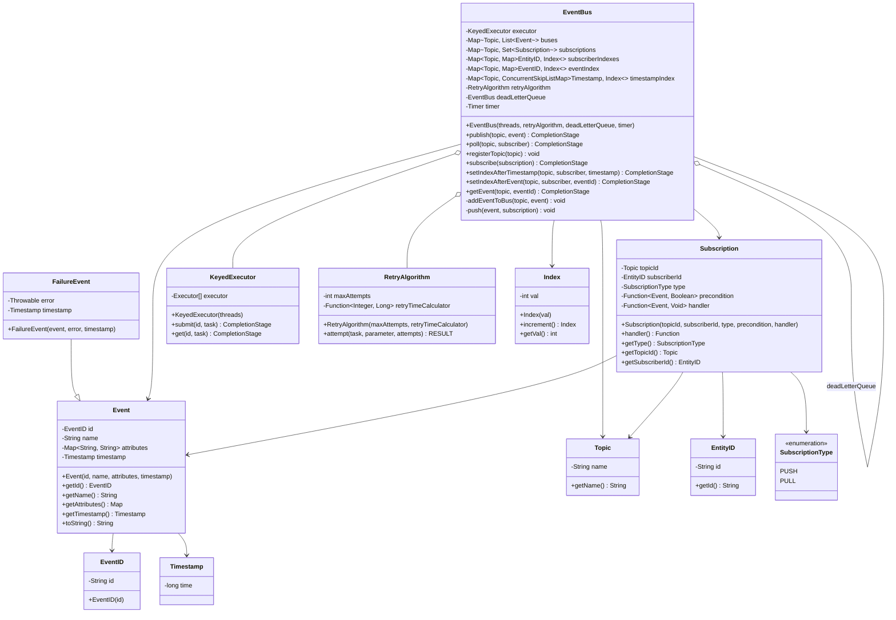

# UML Class Diagrams - LLD Systems

## 1. Event Bus System

### Class Diagram

### Sequence Diagram - Publish Event Flow

### Sequence Diagram - Poll Event Flow

---

## 2. Parking Lot System

### Class Diagram

### Sequence Diagram - Park Vehicle

### Sequence Diagram - Unpark & Payment

---

## 3. Rate Limiter System

### Class Diagram

### Sequence Diagram - Token Bucket Algorithm

### Sequence Diagram - Sliding Window Algorithm

### Algorithm Comparison

| Algorithm | Pros | Cons | Use Case |
|-----------|------|------|----------|
| **Token Bucket** | Smooth traffic, allows bursts | Complex implementation | API rate limiting with burst handling |
| **Leaky Bucket** | Consistent output rate | Strict, no burst support | Network traffic shaping |
| **Fixed Window** | Simple, memory efficient | Edge case issues (spike at boundary) | Basic rate limiting |
| **Sliding Window** | Accurate, no boundary issues | Higher memory usage | Precise rate limiting needs |

---

## Key Design Patterns Used

### Event Bus
- **Observer Pattern**: PUSH subscribers get notified automatically
- **Publisher-Subscriber Pattern**: Decoupled communication
- **Command Pattern**: Events as commands
- **Strategy Pattern**: Different retry algorithms
- **Thread Pool Pattern**: KeyedExecutor for ordering

### Parking Lot
- **Singleton Pattern**: ParkingLot instance
- **Factory Pattern**: Creating different vehicle types
- **Strategy Pattern**: Different payment methods
- **State Pattern**: ParkingSpot status transitions

### Rate Limiter
- **Strategy Pattern**: Different rate limiting algorithms
- **Factory Pattern**: RateLimiterFactory
- **Singleton Pattern**: Rate limiter instances per user
- **Template Method**: Common rate limiting flow

---

## SOLID Principles Applied

### Single Responsibility
- Each class has one reason to change
- Event handles only event data
- EventBus handles only routing logic

### Open/Closed
- Rate limiter algorithms can be extended without modification
- New vehicle types can be added easily

### Liskov Substitution
- All RateLimiter implementations are interchangeable
- Vehicle subtypes can replace parent type

### Interface Segregation
- Small, focused interfaces (RateLimiter)
- Clients depend only on methods they use

### Dependency Inversion
- High-level modules depend on abstractions (RateLimiter interface)
- EventBus depends on RetryAlgorithm abstraction
